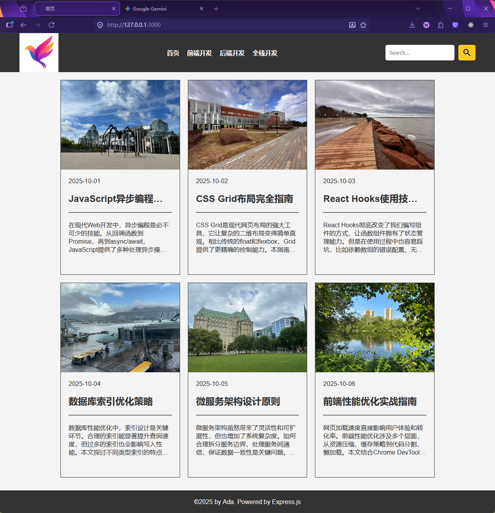
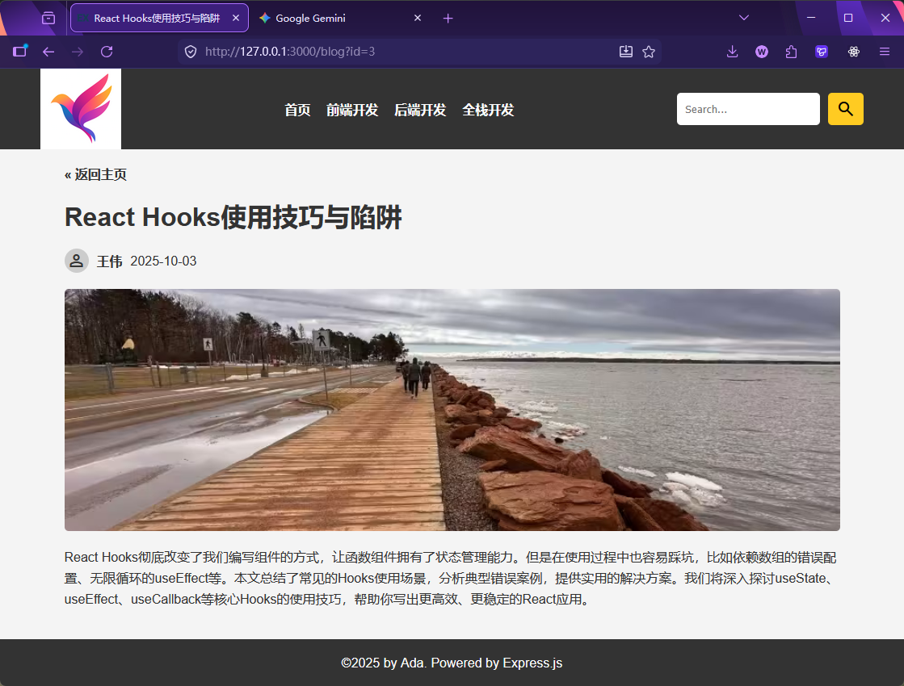
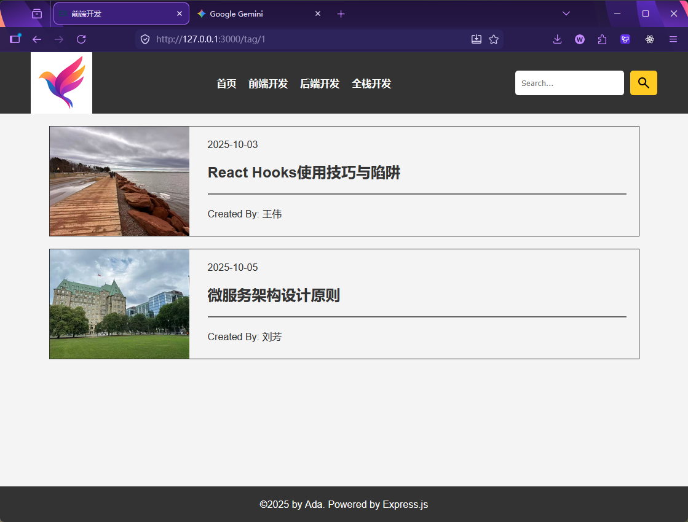
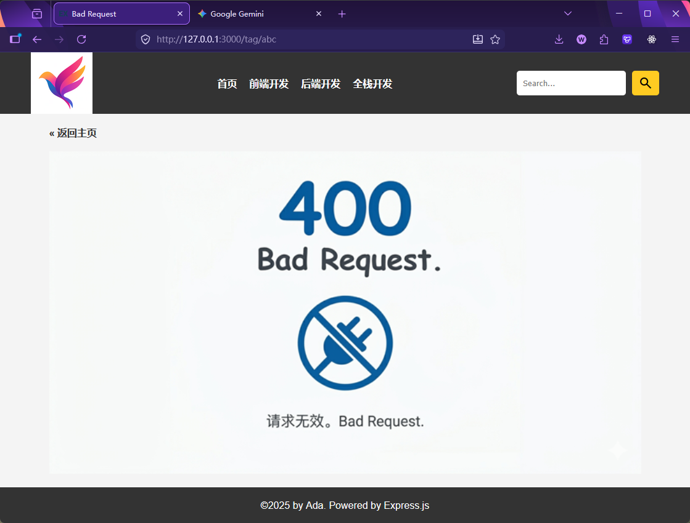
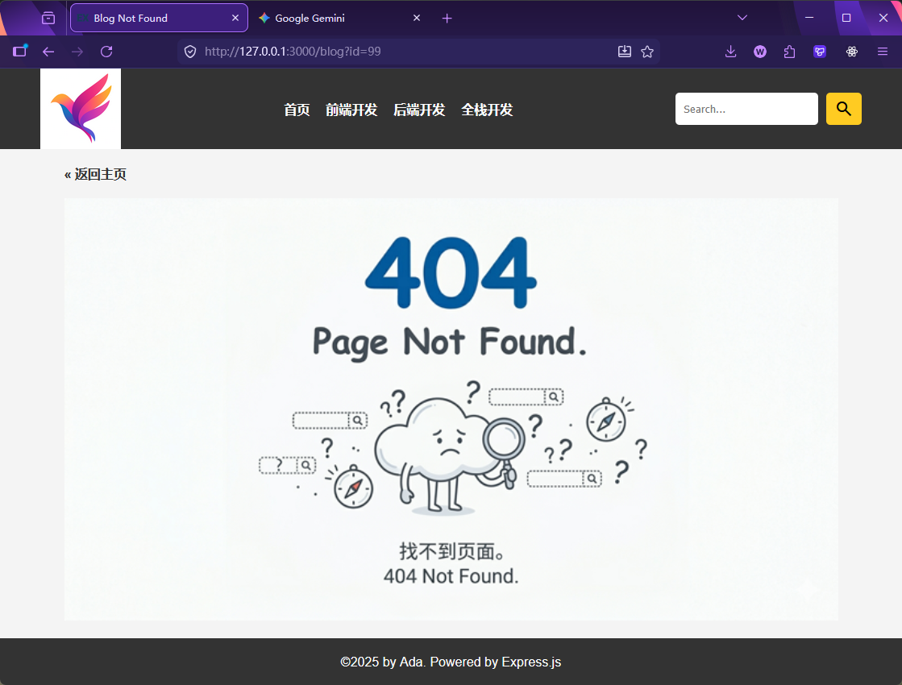

[← 返回首页](../readme.md)

# 阶段项目：Express 简易 Blog 系统

## 目录约定

```
03_express_plus/
  README.md
  codes/          ← 完整参考实现，可直接运行对照
  practice/       ← 你的工作目录
    package.json  ← 已预配置，npm install 即可开始
    data.js       ← 博客数据（直接使用，无需修改）
    原始HTML设计/  ← 项目起点：设计好的静态页面
```

---

## 项目目标

本项目是第 3 章的综合练习，目标是将 `practice/原始HTML设计/` 中已经设计好的**静态 HTML 网站**，改造为由 Express + EJS 驱动的**动态网站**。

改造前（静态）：
- 页面内容硬编码在 HTML 中
- 导航链接指向固定的 `.html` 文件
- 无法根据数据动态生成内容

改造后（动态）：
- 数据来自 `data.js`（后续章节会替换为数据库）
- 路由由 Express 管理
- 页面由 EJS 模板渲染，header/footer 抽取为 partials 复用

---

## 数据结构

`data.js` 导出两个数组，了解它们的结构是第一步：

```js
// 标签（分类）
const tags = [
    { id: 1, name: "前端开发" },
    { id: 2, name: "后端开发" },
    { id: 3, name: "全栈开发" },
];

// 博客文章
const blogs = [
    {
        id: 1,
        title: "JavaScript异步编程最佳实践",
        content: "...",
        image: "/images/a1.avif",
        author: "李明",
        tag_id: 3,       // 对应 tags 中的 id
        created_at: "2025-10-01",
    },
    // ...
];
```

`blog.tag_id` 与 `tag.id` 关联，这是最基础的数据关系。

---

## 项目结构

完成后的目录结构如下：

```
practice/
  server.js
  data.js
  package.json
  views/
    index.ejs           ← 首页：博客卡片列表
    blog.ejs            ← 博客详情页
    tag.ejs             ← 按标签过滤的博客列表
    error.ejs           ← 统一错误页（400 / 404）
    partials/
      header.ejs        ← 公共头部（含导航）
      footer.ejs        ← 公共底部
  public/
    css/style.css
    favicon.ico
    images/
```

---

## 实现步骤

### 步骤一：初始化项目

```bash
cd practice
npm install
```

创建 `server.js`，搭建 Express 基础骨架：

```js
import express from "express";
import { blogs, tags } from "./data.js";

const app = express();
const PORT = 3000;

app.set("view engine", "ejs");
app.set("views", "./views");
app.use(express.static("public"));

// 路由写在这里...

app.listen(PORT, () => {
    console.log(`Server is running on http://localhost:${PORT}`);
});
```

启动：

```bash
nodemon server.js
```

---

### 步骤二：整理静态资源

将 `原始HTML设计/css/` 和 `原始HTML设计/images/` 复制到 `public/` 目录下，让 `express.static("public")` 接管静态文件服务。

---

### 步骤三：拆分 EJS Partials

观察三个 HTML 文件，`<header>` 和 `<footer>` 部分完全重复。把它们抽出来，避免每个页面都复制一份：

**`views/partials/header.ejs`** — 包含完整 `<html>`、`<head>`、`<header>` 开标签，直至 `<main>` 开标签。

关键点：导航栏中的标签链接需要动态生成，从静态写死改为循环：

```html
<!-- 改造前（静态）-->
<li><a href="./tag.html">Technical</a></li>
<li><a href="./tag.html">Education</a></li>

<!-- 改造后（动态）-->
<% for (let item of tags) { %>
    <li><a href="/tag/<%= item.id %>"><%= item.name %></a></li>
<% } %>
```

注意：`tags` 需要从路由传入模板，**每个路由的 `res.render()` 都要传递 `tags`**，因为 header 中要用到它。

**`views/partials/footer.ejs`** — 包含 `</main>`、`<footer>`、`</body>`、`</html>`。

在需要的模板中引入：

```html
<%- include('./partials/header') %>

<!-- 页面内容 -->

<%- include('./partials/footer') %>
```

---

### 步骤四：实现三条路由

#### 路由一：首页 `GET /`

返回所有博客的卡片列表。

```js
app.get("/", (req, res) => {
    res.render("index", { title: "首页", blogs, tags });
});
```

**`views/index.ejs`** 中循环渲染博客卡片，并截取 `content` 的前 100 个字作为摘要：

```html
<% for (let blog of blogs) { %>
    <div class="blogCard">
        <div class="image">" alt=""></div>
        <div class="content">
            <p><%= blog.created_at %></p>
            <h2><a href="/blog?id=<%= blog.id %>"><%= blog.title %></a></h2>
            <hr>
            <p><%= blog.content.slice(0, 100) %></p>
        </div>
    </div>
<% } %>
```

---

#### 路由二：博客详情 `GET /blog?id=1`

用**查询参数**（`req.query.id`）接收博客 id。

```js
app.get("/blog", (req, res) => {
    const blogId = Number(req.query.id);
    if (isNaN(blogId) || blogId <= 0) {
        return res.status(400).render("error", { title: "Bad Request", image_name: "400.png", tags });
    }

    const blogById = blogs.find(b => b.id === blogId);
    if (!blogById) {
        return res.status(404).render("error", { title: "Blog Not Found", image_name: "404.png", tags });
    }

    res.render("blog", { title: blogById.title, blogById, tags });
});
```

> **查询参数 vs 路径参数**
>
> | | 写法 | 读取方式 | 适用场景 |
> |---|---|---|---|
> | 查询参数 | `/blog?id=1` | `req.query.id` | 可选参数、过滤条件 |
> | 路径参数 | `/blog/1` | `req.params.id` | 资源标识符 |

---

#### 路由三：标签页 `GET /tag/:id`

用**路径参数**（`req.params.id`）接收标签 id，过滤出该标签下的所有博客。

```js
app.get("/tag/:id", (req, res) => {
    const tagId = Number(req.params.id);
    if (isNaN(tagId) || tagId <= 0) {
        return res.status(400).render("error", { title: "Bad Request", image_name: "400.png", tags });
    }

    const tag = tags.find(t => t.id === tagId);
    const blogsByTag = blogs.filter(b => b.tag_id === tagId);

    if (!tag || blogsByTag.length === 0) {
        return res.status(404).render("error", { title: "No Blogs Found", image_name: "404.png", tags });
    }

    res.render("tag", { title: tag.name, blogsByTag, tags });
});
```

---

#### 兜底 404

放在所有路由之后：

```js
app.use((req, res) => {
    res.status(404).render("error", { title: "Page Not Found", image_name: "404.png", tags });
});
```

---

## 完成后的效果

**首页 `/`** — 博客卡片列表



**博客详情页 `/blog?id=1`**



**标签页 `/tag/:id`** — 按分类过滤



**400 Bad Request** — 参数非法（如 `/tag/abc`）



**404 Not Found** — 资源不存在（如 `/blog?id=99`）


