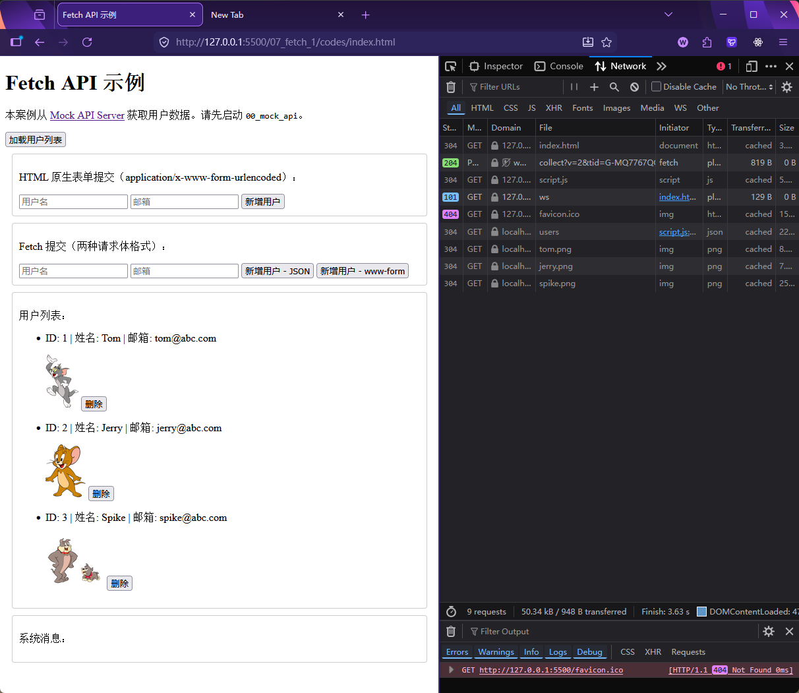

[← 返回首页](../readme.md)

# 第 7 章：使用 Fetch 进行 API 调用

## 前置条件

本章所有请求都发往本地 Mock API 服务器，**运行代码前必须先启动它**：

```bash
cd 07_mock_api
npm install
npm run dev
```

启动后访问 `http://localhost:3000` 验证服务正常。

## 目录约定

```
07_fetch_1/
  README.md
  codes/
    tsconfig.json
    index.html        ← 演示页面
    src/
      script.ts       ← 完整实现
    dist/
  practice/
    tsconfig.json
    index.html        ← 同上，供学生使用
    src/
      script.ts       ← 在这里完成实现
    dist/
```

**工作流：**

```bash
cd codes       # 或 practice
tsc --watch
# 打开 index.html
```

---

## 7.1 fetch 基础与 Promise

`fetch()` 是浏览器原生提供的异步请求 API，调用后立即返回一个 `Promise<Response>` 对象。

```typescript
// 同步函数中调用 fetch，只能拿到 Promise pending 状态
function fetchTest() {
    const promise: Promise<Response> = fetch("https://jsonplaceholder.typicode.com/posts/1");
    console.log(promise); // Promise { <pending> }
}
fetchTest();
```

Promise 有三种状态：

| 状态 | 含义 |
|---|---|
| `pending` | 请求已发出，等待响应 |
| `fulfilled` | 请求成功，持有响应结果 |
| `rejected` | 请求失败，持有错误原因 |

### async / await

用 `async/await` 以同步风格处理异步请求：

```typescript
async function fetchData() {
    try {
        const response = await fetch("https://jsonplaceholder.typicode.com/posts/1");
        console.log(response); // Response 对象：状态码、headers、body 等

        if (response.ok) {
            const data = await response.json(); // 解析响应体为 JSON
            console.log(data);
        } else {
            throw new Error(`请求失败，状态码：${response.status}`);
        }
    } catch (error) {
        console.error("请求出错：", error);
    } finally {
        console.log("请求流程结束"); // 无论成功或失败都会执行
    }
}

fetchData();
```

### .then() / .catch()

`async/await` 是 Promise 的语法糖，同样的逻辑也可以用 `.then().catch()` 链式写法实现：

```typescript
function fetchData() {
    fetch("https://jsonplaceholder.typicode.com/posts/1")
        .then((response) => {
            if (response.ok) {
                return response.json(); // 返回下一个 Promise
            } else {
                throw new Error(`请求失败，状态码：${response.status}`);
            }
        })
        .then((data) => {
            console.log(data); // 上一个 .then 返回的 json 解析结果
        })
        .catch((error) => {
            console.error("请求出错：", error); // 网络错误或手动 throw 都在这里捕获
        })
        .finally(() => {
            console.log("请求流程结束");
        });
}

fetchData();
```

两种写法等价，选择哪种是风格偏好。链式写法在回调层级较深时容易嵌套，可读性下降；`async/await` 结构更接近同步代码，更易阅读和调试。

> **本课程统一使用 `async/await` 语法。**

### Response 对象常用属性

```typescript
response.ok       // 状态码为 200–299 时为 true
response.status   // HTTP 状态码，如 200、404、500
response.json()   // 将响应体解析为 JSON，返回 Promise
response.text()   // 将响应体解析为纯文本，返回 Promise
```

---

## 7.2 GET 请求：获取数据

```typescript
interface User {
    id: number;
    name: string;
    email: string;
    image: string;
}

const baseUrl = "http://localhost:3000";

async function getUserList() {
    try {
        const response = await fetch(`${baseUrl}/api/users`); // 默认 GET
        if (response.ok) {
            const users: User[] = await response.json();
            renderUserList(users);
        } else {
            throw new Error(`获取失败，状态码：${response.status}`);
        }
    } catch (err) {
        console.error(err);
    }
}
```

### 用 Firefox Network 工具观察请求

打开 Firefox 开发者工具（`F12`）→ **Network** 标签，刷新页面后即可看到每一次 `fetch` 请求的详情：点击某条请求，可以在右侧面板查看请求方法、URL、状态码、请求头、响应体等信息。



这是调试网络请求最直接的方式——当请求结果不符合预期时，先来这里确认实际发出的请求和收到的响应内容。

---

## 7.3 POST 请求：提交数据

POST 请求需要在 `fetch` 的第二个参数中指定 `method`、`headers` 和 `body`。

### 方式一：JSON 格式（推荐）

```typescript
async function addUserJSON(name: string, email: string) {
    const response = await fetch(`${baseUrl}/api/users`, {
        method: "POST",
        headers: {
            "Content-Type": "application/json"
        },
        body: JSON.stringify({ name, email }) // 对象序列化为 JSON 字符串
    });
    const result = await response.json();
    console.log(result);
}
```

### 方式二：www-form 格式

```typescript
async function addUserWWW(name: string, email: string) {
    const body = new URLSearchParams();
    body.append("name", name);
    body.append("email", email);
    // body.toString() → "name=Alice&email=alice@example.com"

    const response = await fetch(`${baseUrl}/api/users`, {
        method: "POST",
        headers: {
            "Content-Type": "application/x-www-form-urlencoded"
        },
        body: body.toString()
    });
    const result = await response.json();
    console.log(result);
}
```

### HTML 原生表单 vs Fetch 提交

HTML `<form>` 的 `method="POST"` 提交也会发送 `application/x-www-form-urlencoded` 格式的请求，效果与方式二相同，但会刷新页面。Fetch 提交则不刷新页面，可以完全控制请求和响应处理。

### curl 测试参考

```bash
# JSON 格式
curl -X POST http://localhost:3000/api/users \
  -H "Content-Type: application/json" \
  -d '{"name":"张三","email":"zhangsan@example.com"}'

# www-form 格式
curl -X POST http://localhost:3000/api/users \
  -d "name=张三&email=zhangsan@example.com"
```

---

## 7.4 异常处理

Fetch 的错误分两类，处理方式不同：

| 错误类型 | 触发时机 | 处理方式 |
|---|---|---|
| 网络错误 | 无法连接服务器（断网、端口不通） | `catch` 捕获 |
| HTTP 错误 | 服务器返回 4xx / 5xx 状态码 | `response.ok` 判断后手动 `throw` |

```typescript
async function safeRequest() {
    try {
        const response = await fetch(`${baseUrl}/api/users/999`);

        // fetch 本身不会因为 4xx/5xx 抛异常，需要手动判断
        if (!response.ok) {
            throw new Error(`服务器错误：${response.status}`);
        }

        const data = await response.json();
        console.log(data);
    } catch (err) {
        // 网络错误（如服务未启动）和手动 throw 都在这里捕获
        console.error("请求失败：", err);
    }
}
```

---

## 7.5 TypeScript 类型约束响应数据

用 `interface` 描述后端返回的数据结构，让编译器帮你检查字段使用是否正确：

```typescript
interface User {
    id: number;
    name: string;
    email: string;
    image: string;
}

// 明确告知 TypeScript：response.json() 解析出来的是 User[]
const users: User[] = await response.json();

// 此后访问字段时，IDE 会提供自动补全，并在拼错字段名时报错
console.log(users[0].name);   // ✅
console.log(users[0].nname);  // ❌ 编译报错
```

> 这正是第 4 章引入 TypeScript 的核心原因：与后端对接时，先用 `interface` 把数据结构写清楚，再写请求逻辑，可以大幅减少字段拼写错误和类型不匹配的问题。
