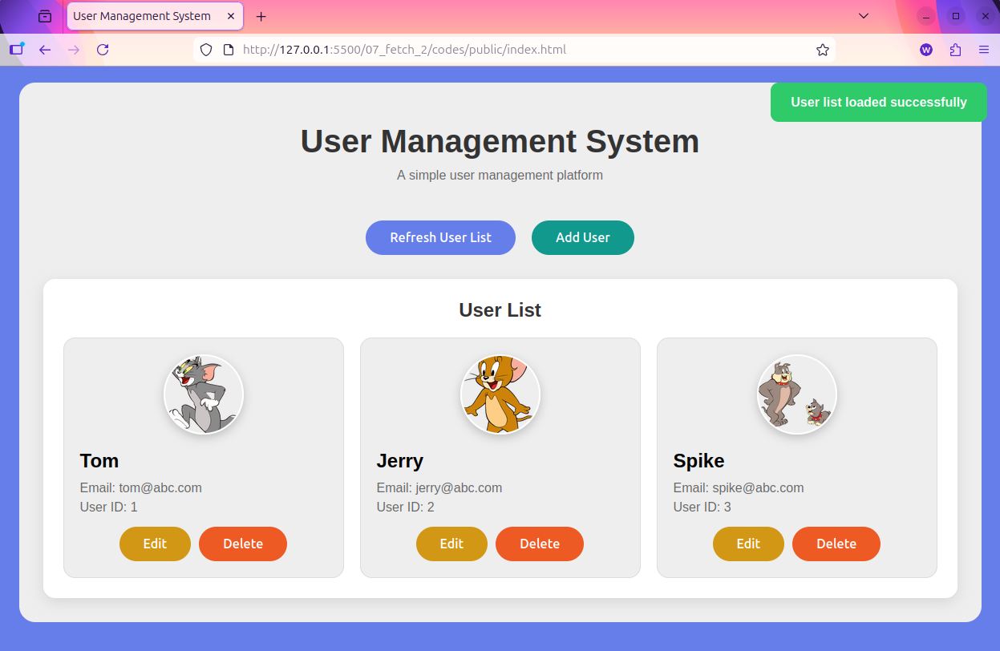

[← Back to Home](../readme.md)

# Chapter 7 (Continued): Multi-Page User Management System

This case study extends `07_fetch_1`, upgrading the single-page demo into a three-page user management system with full CRUD (Create, Read, Update, Delete). New topics covered:

- **PUT requests**: modifying existing resources
- **Shared script across multiple pages**: three HTML pages using the same compiled `script.js`
- **Passing data via URL parameters**: using `?id=3` to pass data between pages
- **Auto-fetch on page load**: entering the edit page automatically pre-fills the form

## Prerequisites

All requests in this chapter are sent to a local Mock API server. **You must start it before running any code:**

```bash
cd 07_mock_api
npm install
npm run dev
```

## Directory Structure

```
07_fetch_2/
  README.md
  codes/
    tsconfig.json
    public/
      index.html       ← User list page
      add-user.html    ← Add user page
      edit-user.html   ← Edit user page
      style.css
    src/
      script.ts        ← One script shared by all three pages
    dist/
  practice/
    tsconfig.json
    public/            ← Same as above
    src/
      script.ts        ← Complete the implementation here
    dist/
```

**Workflow:**

```bash
cd codes       # or practice
tsc --watch
# Open public/index.html
```

---

## 7.1 Designing a Shared Script for Multiple Pages

All three HTML pages load the same script at the bottom:

```html
<script src="../dist/script.js"></script>
```

`tsconfig.json` compiles `src/script.ts` to `dist/script.js`. The three HTML pages reference it via the `../dist/` relative path (`public/` → up one level → `dist/`).

Each of the three pages has different DOM elements:

| Page | Unique Elements |
|---|---|
| `index.html` | `#loadBtn`, `#addUserBtn`, `#userGrid` |
| `add-user.html` | `#username`, `#email`, `#submitAdd` |
| `edit-user.html` | `#userId`, `#username`, `#email`, `#submitUpdate` |
| All pages | `#message` |

When the script runs on one page, elements unique to the other pages do not exist — `document.getElementById()` returns `null`. Therefore every DOM operation must include a null check first, or a runtime error will be thrown.

---

## 7.2 The Guard Pattern

The `&&` short-circuit operator provides a concise way to express "execute only if the element exists":

```typescript
// Equivalent to: if (loadBtn) { getUsers(); }
loadBtn && getUsers();

// Equivalent to: if (loadBtn) { loadBtn.addEventListener("click", getUsers); }
loadBtn && loadBtn.addEventListener("click", getUsers);

// Equivalent to: if (submitUpdate) { getUserById(Number(currentUserId)); }
submitUpdate && getUserById(Number(currentUserId));
```

This is the core technique for sharing a script across multiple pages: the same code activates selectively on each page, without needing to determine which page is currently loaded.

---

## 7.3 PUT Requests: Updating a User

PUT requests are nearly identical in format to POST requests. The difference is that the URL includes the target resource's ID, and the semantic meaning is "replace the entire resource":

```typescript
async function updateUser(name: string, email: string, id: number) {
    try {
        const response = await fetch(`${baseUrl}/api/users/${id}`, {
            method: "PUT",
            headers: { "Content-Type": "application/json" },
            body: JSON.stringify({ name, email })
        });
        if (response.ok) {
            renderMessage("User updated successfully", "success");
            setTimeout(() => {
                window.location.href = "./index.html";
            }, 2000);
        } else {
            throw new Error(`Update failed with status: ${response.status}`);
        }
    } catch (err) {
        renderMessage(`Failed to update user: ${err}`, "error");
    }
}
```

Common HTTP methods and their semantics:

| Method | Semantic | Example URL |
|---|---|---|
| GET | Read a resource | `/api/users` or `/api/users/3` |
| POST | Create a resource | `/api/users` |
| PUT | Replace an entire resource | `/api/users/3` |
| DELETE | Delete a resource | `/api/users/3` |

---

## 7.4 Passing Data Between Pages via URL Parameters

When navigating from the list page to the edit page, the user ID must be appended to the URL:

```typescript
function editUser(userId: number) {
    window.location.href = `./edit-user.html?id=${userId}`;
    // After navigation, URL becomes: edit-user.html?id=3
}
```

On the edit page, read the URL query string using `URLSearchParams`:

```typescript
// window.location.search returns the query string of the URL, e.g. "?id=3"
const urlParams = new URLSearchParams(window.location.search);
const currentUserId = urlParams.get("id"); // returns the string "3", or null if not present
```

`URLSearchParams.get()` returns `string | null`, so a type conversion is needed before use:

```typescript
getUserById(Number(currentUserId)); // "3" → 3
```

---

## 7.5 Auto-Fetch on Page Load

When entering the edit page, the current user data should be fetched automatically and the form pre-filled — no manual trigger by the user is needed:

```typescript
// Executes immediately on page load (submitUpdate only exists on edit-user.html)
submitUpdate && getUserById(Number(currentUserId));
```

If the fetch fails, the form should be disabled to prevent the user from submitting empty data. A brief error message is shown before redirecting back to the home page:

```typescript
async function getUserById(id: number) {
    try {
        const response = await fetch(`${baseUrl}/api/users/${id}`);
        if (response.ok) {
            const user: User = await response.json();
            userIdInput.value = user.id.toString();
            usernameInput.value = user.name;
            emailInput.value = user.email;
        } else {
            throw new Error(`Fetch failed with status: ${response.status}`);
        }
    } catch (err) {
        usernameInput.disabled = true;
        emailInput.disabled = true;
        submitUpdate.disabled = true;
        renderMessage(`Failed to load user: ${err}`, "error");
        setTimeout(() => {
            window.location.href = "./index.html";
        }, 2000);
    }
}
```

---

## 7.6 Feedback Message Component

`renderMessage()` encapsulates the complete logic for user action feedback:

```typescript
function renderMessage(text: string, type: string) {
    message.textContent = text;
    message.classList.add("show", type); // trigger display
    setTimeout(() => {
        message.classList.remove("show", type); // auto-hide after 3 seconds
    }, 3000);
}
```

Corresponding CSS:

```css
.message { display: none; }       /* hidden by default */
.message.show { display: block; } /* visible when the show class is present */
.message.success { background-color: #2fca6a; } /* green */
.message.error   { background-color: #ee5a24; } /* red */
```

Usage:

```typescript
renderMessage("User added successfully", "success");
renderMessage(`Delete failed: ${err}`, "error");
```

---

## Final Result


