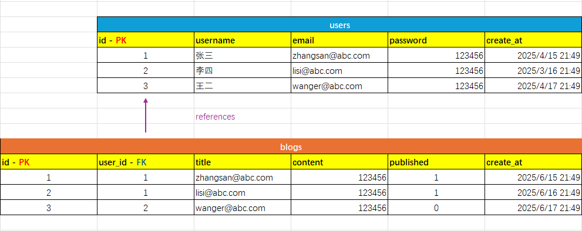
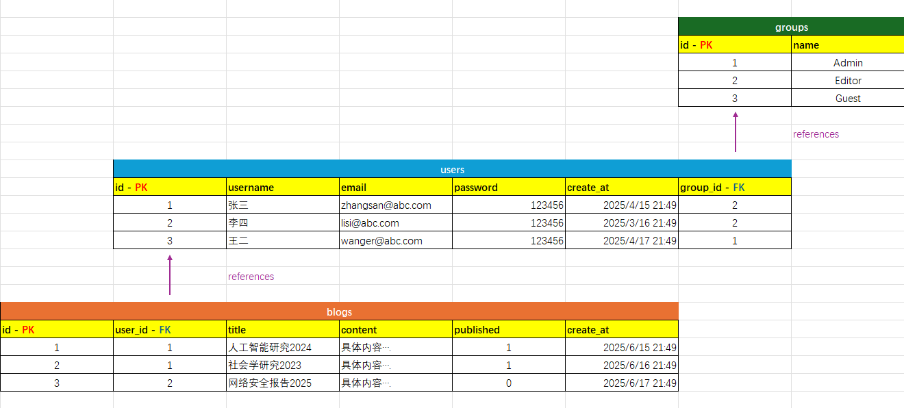
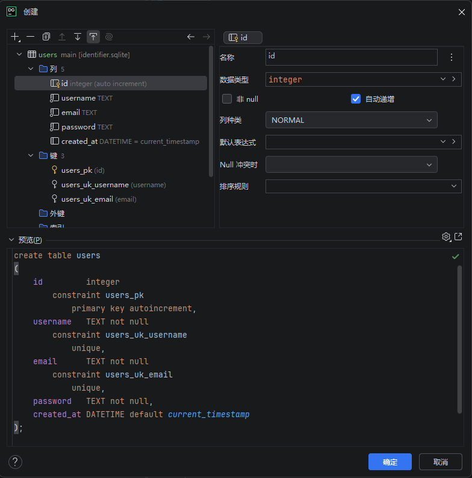

[← 返回首页](../readme.md)

# 第 9 章：SQLite 数据库入门

本章介绍关系型数据库的基本概念，并使用 DataGrip 演示如何操作 SQLite 数据库。全程以 SQL 命令为核心，观察 DataGrip 生成的语句，再手动编写定制查询。

完整 SQL 脚本见 [`scripts/console.sql`](./scripts/console.sql)，可直接在 DataGrip 中打开并逐段执行。

---

## 9.1 关系型数据库的核心概念

### 用 Excel 理解"表"

数据库中的**表（Table）**与 Excel 表格本质相同——行是记录，列是字段。

以学生信息为例，每一行是一名学生（记录），每一列是一个属性（字段）：

| 记录编号 | 学号      | 姓名 | 年龄 | 年级 | 家庭住址     | 入学时间 |
| -------- | --------- | ---- | ---- | ---- | ------------ | -------- |
| 1        | A20241001 | 张伟 | 18   | 1    | 北京市海淀区 | 2023/9/1 |
| 2        | A20241002 | 李静 | 19   | 2    | 上海市徐汇区 | 2022/9/1 |
| 3        | B20241003 | 王磊 | 20   | 3    | 广州市天河区 | 2021/9/1 |

### 当两张表发生关联

如果再有一张文章表，用"作者"列直接存储姓名：

| 文章编号 | 文章名称                   | 文章内容                                                  | 作者 | 创作时间   |
| -------- | -------------------------- | --------------------------------------------------------- | ---- | ---------- |
| 101      | 人工智能在教育中的应用     | 本文探讨了人工智能技术在现代教育场景中的应用…             | 张伟 | 2024/12/15 |
| 102      | Web 前端框架对比分析       | 比较了当前主流前端框架如 React、Vue 和 Angular 的优势…    | 李静 | 2024/12/20 |
| 103      | 绿色能源的发展趋势         | 分析了全球绿色能源的发展现状、挑战以及未来的趋势…         | 王磊 | 2025/1/5   |
| 104      | 区块链在金融行业的应用     | 介绍了区块链技术在支付、清算、供应链金融等方面的实践案例… | 陈芳 | 2025/1/8   |
| 105      | 现代城市交通问题及解决方案 | 探讨了城市交通拥堵的成因与智能交通系统的潜在解决方式…     | 刘强 | 2025/1/10  |

这样设计有明显问题：

- 作者姓名重复存储，浪费空间
- 如果学生改名，所有文章的"作者"列都要跟着改
- 无法准确区分同名学生

正确做法是：文章表只存储学生的**编号**（id），通过编号关联到学生表——这就是**外键（Foreign Key）**。

### 主键与外键

| 概念                    | 说明                                                      |
| ----------------------- | --------------------------------------------------------- |
| **主键（Primary Key）** | 唯一标识一条记录，同一张表中不可重复，通常用自增整数 `id` |
| **外键（Foreign Key）** | 引用另一张表的主键，建立两张表之间的关联                  |

下图展示了 `users` 和 `blogs` 两张表的关联关系：



`blogs` 表的 `user_id`（外键）引用 `users` 表的 `id`（主键）。一个用户可以发布多篇博客——这是**一对多**关系。

### 多表关联

随着需求增长，可以继续增加表。下图加入了 `groups` 表，用来记录用户所属的权限组：



`users.group_id` 引用 `groups.id`，`blogs.user_id` 引用 `users.id`。三张表通过主外键形成一条关联链。

---

## 9.2 主流关系型数据库简介

| 数据库     | 初始年份 | 特点                                                         |
| ---------- | -------- | ------------------------------------------------------------ |
| SQLite     | 2000     | 嵌入式、轻量、无服务器，数据库即单个文件，适合教学和本地开发 |
| PostgreSQL | 1989     | 开源、功能完整、标准兼容性最好，适合生产环境                 |
| MySQL      | 1995     | Web 开发常用，简洁高效，社区庞大                             |
| Oracle     | 1979     | 商业数据库领导者，稳定性强，适合大型企业                     |
| MSSQL      | 1989     | 微软出品，与 Windows 深度集成                                |

本章使用 **SQLite**，无需安装数据库服务，数据库就是一个 `.sqlite` 文件，适合入门。

---

## 9.3 DataGrip 创建数据库

1. 打开 DataGrip → **New Project**
2. 左侧 Database Explorer → **+** → **Data Source** → **SQLite**
3. **File** 一栏选择或新建一个 `.sqlite` 文件路径（本章演示时使用的是 `data/` 目录）
4. 点击 **Test Connection**（首次使用会提示下载驱动，按提示确认）→ **OK**

连接成功后，在 Database Explorer 中右键数据库 → **New** → **Query Console**，即可输入并执行 SQL 语句。

也可以通过Datagrip的图形化向导逐步创建SQL语句。



> **`data/` 目录说明：** 这是 DataGrip 存放数据库文件的目录，`data/db1.sqlite` 是本章演示时产生的数据库文件，可以直接用 DataGrip 打开查看，也可以直接用vscode的sqlite viewer直接查看。

---

## 9.4 DDL：定义表结构

DDL（Data Definition Language）用于创建、修改、删除数据库对象。

### CREATE TABLE

```sql
CREATE TABLE IF NOT EXISTS users (
    id         INTEGER  PRIMARY KEY AUTOINCREMENT,
    username   TEXT     NOT NULL UNIQUE,
    email      TEXT     NOT NULL UNIQUE,
    password   TEXT     NOT NULL,
    created_at DATETIME DEFAULT CURRENT_TIMESTAMP
);

CREATE TABLE IF NOT EXISTS blogs (
    id         INTEGER  PRIMARY KEY AUTOINCREMENT,
    user_id    INTEGER  NOT NULL,
    title      TEXT     NOT NULL,
    content    TEXT     NOT NULL,
    published  BOOLEAN  DEFAULT 0,
    created_at DATETIME DEFAULT CURRENT_TIMESTAMP,
    FOREIGN KEY (user_id) REFERENCES users(id) ON DELETE CASCADE
);
```

**关键字说明：**

| 关键字                       | 作用                                           |
| ---------------------------- | ---------------------------------------------- |
| `PRIMARY KEY`                | 主键，值在整张表中唯一                         |
| `AUTOINCREMENT`              | 插入新记录时 id 自动递增                       |
| `NOT NULL`                   | 该字段不允许为空                               |
| `UNIQUE`                     | 该字段在整张表中不允许重复                     |
| `DEFAULT`                    | 插入时若不提供该字段，使用默认值               |
| `FOREIGN KEY ... REFERENCES` | 声明外键，引用另一张表的主键                   |
| `ON DELETE CASCADE`          | 当被引用的记录删除时，级联删除本表中关联的记录 |

**SQLite 常用数据类型：**

| 类型       | 说明                              |
| ---------- | --------------------------------- |
| `INTEGER`  | 整数                              |
| `TEXT`     | 字符串                            |
| `REAL`     | 浮点数                            |
| `BOOLEAN`  | 布尔值（SQLite 内部存储为 0 / 1） |
| `DATETIME` | 日期时间（SQLite 内部存储为文本） |

---

## 9.5 DML：增删改查

DML（Data Manipulation Language）用于对数据进行增删改查。

### INSERT — 插入数据

```sql
-- 插入单条记录
INSERT INTO users (username, email, password)
VALUES ('alice', 'alice@example.com', 'password123');

-- 一次插入多条记录
INSERT INTO users (username, email, password)
VALUES
    ('bob', 'bob@example.com', 'password123'),
    ('jack', 'jack@example.com', 'password123');
```

字符串中若包含单引号，用两个单引号转义：

```sql
INSERT INTO blogs (user_id, title, content)
VALUES (2, 'Bob''s Note', 'Unpublished content.');
```

### SELECT — 查询数据

```sql
-- 查询所有字段
SELECT * FROM users;

-- 查询指定字段
SELECT username, email FROM users;

-- 条件过滤
SELECT * FROM blogs WHERE user_id = 1;
SELECT * FROM blogs WHERE published = 1;
```

### JOIN — 跨表查询

单张表无法同时得到博客标题和作者名，需要用 `JOIN` 将两张表合并：

```sql
-- 查询所有博客及其作者名
SELECT blogs.id, blogs.title, users.username, blogs.published
FROM blogs
JOIN users ON blogs.user_id = users.id;

-- 使用表别名，更简洁
SELECT b.id, b.title, u.username, b.published
FROM blogs AS b
JOIN users AS u ON b.user_id = u.id;
```

`JOIN ... ON` 指定连接条件：把 `blogs.user_id` 与 `users.id` 相等的行合并为一行。

### UPDATE — 修改数据

```sql
UPDATE blogs SET title = 'My Updated Blog Title' WHERE id = 1;
UPDATE blogs SET published = 1 WHERE id = 2;
UPDATE users SET password = 'password456' WHERE id = 1;
```

> **警告：** `UPDATE` 不加 `WHERE` 会更新整张表的所有记录，操作前务必确认条件。

### DELETE — 删除数据

```sql
-- 删除一篇博客
DELETE FROM blogs WHERE id = 2;

-- 删除一个用户（blogs 有 ON DELETE CASCADE，关联博客会自动删除）
DELETE FROM users WHERE id = 2;
```

> **警告：** `DELETE` 不加 `WHERE` 会清空整张表，操作前务必确认条件。

---

## 9.6 ALTER TABLE：修改表结构

有时需要在已有表上增加字段或重命名。SQLite 对 `ALTER TABLE` 的支持有限：

### SQLite 支持的操作

```sql
-- 添加列
ALTER TABLE users ADD COLUMN group_id INTEGER;

-- 重命名列
ALTER TABLE users RENAME COLUMN username TO user_name;

-- 重命名表
ALTER TABLE users RENAME TO members;
```

### SQLite 不支持的操作

以下操作在 PostgreSQL 中可以直接执行，但 SQLite **不支持**：

```sql
-- ❌ 删除列
ALTER TABLE users DROP COLUMN age;

-- ❌ 修改列的数据类型
ALTER TABLE users ALTER COLUMN age TYPE TEXT;

-- ❌ 添加外键约束到已有列
ALTER TABLE users
ADD CONSTRAINT fk_group FOREIGN KEY (group_id) REFERENCES groups(id);
```

SQLite 遇到这些需求时，必须用"重建表"的方式解决。

---

## 9.7 重建表：SQLite 的数据迁移模式

当需要添加外键约束、删除列、修改列类型时，SQLite 的标准做法是：**新建目标结构的表 → 迁移数据 → 替换旧表**。

以下示例为 `users` 表的 `group_id` 字段补加外键约束：

```sql
-- 第一步：创建包含外键约束的新表
CREATE TABLE new_users (
    id         INTEGER  PRIMARY KEY AUTOINCREMENT,
    username   TEXT     NOT NULL UNIQUE,
    email      TEXT     NOT NULL UNIQUE,
    password   TEXT     NOT NULL,
    created_at DATETIME DEFAULT CURRENT_TIMESTAMP,
    group_id   INTEGER,
    FOREIGN KEY (group_id) REFERENCES groups(id) ON DELETE SET NULL
);

-- 第二步：将旧表数据迁移到新表
INSERT INTO new_users (id, username, email, password, created_at, group_id)
SELECT id, username, email, password, created_at, group_id FROM users;

-- 第三步：旧表重命名（留作备份）
ALTER TABLE users RENAME TO old_users;

-- 第四步：新表改名为正式表名
ALTER TABLE new_users RENAME TO users;
```

这个"创建新表 → 复制数据 → 重命名"的模式，DataGrip 在执行某些结构变更时会自动生成类似的语句。

---

## 附录：DDL vs DML

| 分类    | 全称                       | 包含语句                               | 操作对象           |
| ------- | -------------------------- | -------------------------------------- | ------------------ |
| **DDL** | Data Definition Language   | `CREATE`、`ALTER`、`DROP`              | 表结构、数据库对象 |
| **DML** | Data Manipulation Language | `INSERT`、`SELECT`、`UPDATE`、`DELETE` | 表中的数据         |
