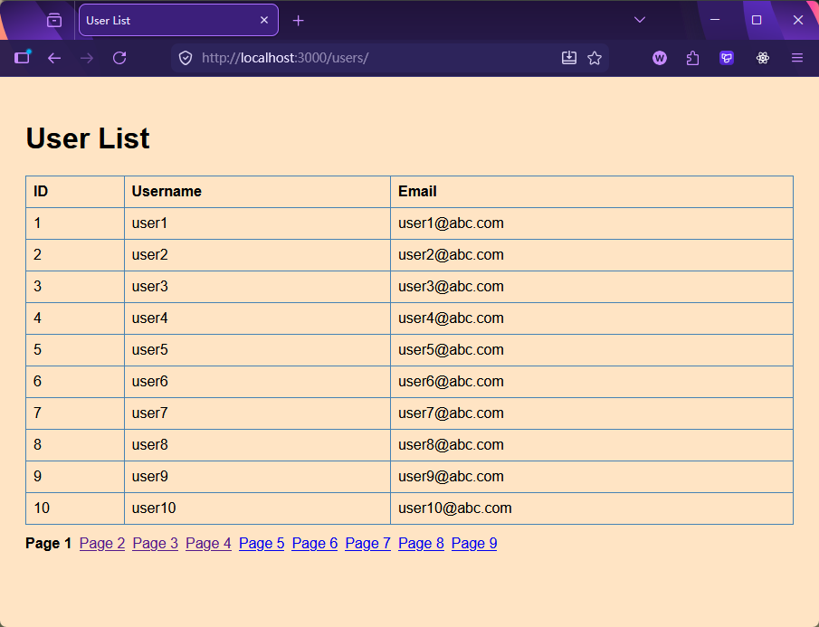
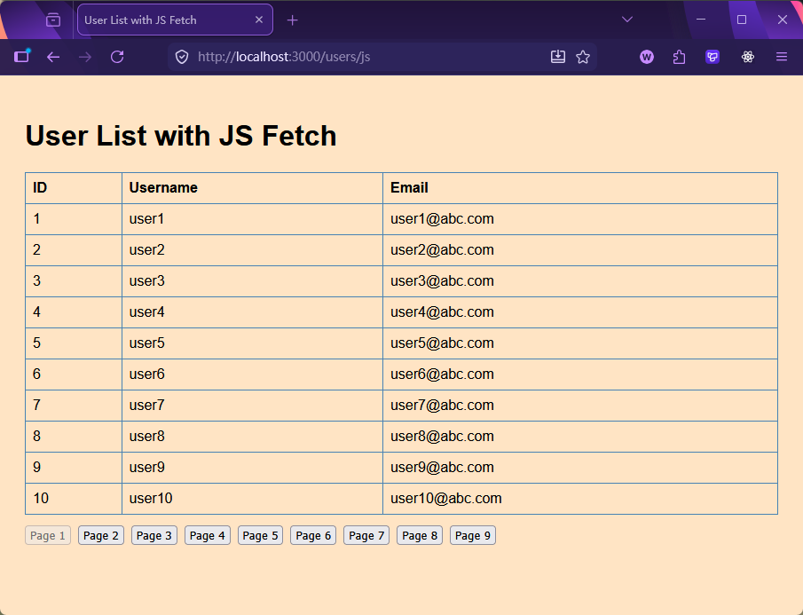

[← 返回首页](../readme.md)

# 第 10 章（进阶）：模块化 Express + SQLite + SSR / CSR

本章在上一章的基础上迈进一步，目标有两个：

1. **代码组织**：将路由、数据库操作、工具函数分目录管理，演示一种可扩展的项目结构。
2. **SSR vs CSR**：用同一份数据，分别实现服务器端渲染（EJS）和客户端渲染（JS Fetch），对比两种方案的工作方式。

## 目录约定

```
10_sqlite_api_pro/
  README.md
  rest_client.http              ← 接口测试脚本
  codes/                        ← 完整参考代码
    package.json
    tsconfig.json
    data/
      init.sql                  ← 建表 + 初始数据
    src/
      app.ts                    ← 入口：注册中间件和路由
      db/
        ConnectionManager.ts    ← 数据库连接（单例）
        dbUsers.ts              ← 数据访问层
      routes/
        api/
          index.ts              ← barrel 导出
          users.ts              ← /api/users CRUD
          blogs.ts              ← /api/blogs（占位）
        web/
          index.ts              ← barrel 导出
          users.ts              ← /users SSR + /users/js CSR
      utils/
        shutdownConnection.ts   ← 优雅退出
    views/
      usersPage.ejs             ← SSR 模板
      index.ejs                 ← CSR 容器页面
      error.ejs                 ← 错误页面
    public/
      css/style.css
      js/index.js               ← 浏览器端脚本（原生 JS）
  practice/                     ← 学生练习目录（结构相同）
```

**启动方式：**

```bash
cd codes
npm install
npm run dev
# 访问 http://localhost:3000
```

---

## 10+.1 代码组织结构

上一章把所有路由都写在 `app.ts` 里，这章引入分层结构：

```
src/
  app.ts          ← 只负责：创建 app、注册中间件、挂载路由
  db/             ← 只负责：数据库连接和 SQL 查询
  routes/api/     ← 只负责：REST API 接口定义
  routes/web/     ← 只负责：页面路由（EJS 渲染）
  utils/          ← 通用工具（与业务无关）
```

`app.ts` 因此变得非常干净：

```typescript
import { users as apiUsers, blogs as apiBlogs } from "./routes/api/index.ts";
import { users as webUsers } from "./routes/web/index.ts";

app.use("/api/users", apiUsers);
app.use("/api/blogs", apiBlogs);
app.use("/users", webUsers);
```

每个目录下有一个 `index.ts` 作为**统一出口（barrel 导出）**，调用方只需从 `index.ts` 导入，无需关心内部文件结构：

```typescript
// routes/api/index.ts
import users from "./users.ts";
import blogs from "./blogs.ts";
export { users, blogs };
```

---

## 10+.2 数据访问层（db/）

### 10+.2.1 ConnectionManager

与上一章相同：模块级变量缓存连接，`getConnection()` / `closeConnection()` 函数对外暴露。

### 10+.2.2 dbUsers.ts — 把 SQL 从路由中剥离

上一章的 SQL 直接写在路由处理函数里。这章单独建 `dbUsers.ts`，把所有针对 `users` 表的数据库操作收拢到一起：

```typescript
// dbUsers.ts — 只做数据库操作，不碰 req / res
export async function getUsers(limit: number, offset: number) {
    const db = await getConnection();
    const users = await db.all("SELECT * FROM users LIMIT ? OFFSET ?", [limit, offset]);
    const totalUsers = await db.get("SELECT COUNT(*) as count FROM users");
    return { total: totalUsers.count, data: users };
}

export async function createUser(username: string, email: string, password: string, group_id: number) {
    const db = await getConnection();
    const result = await db.run(
        "INSERT INTO users (username, email, password, group_id) VALUES (?, ?, ?, ?)",
        [username, email, password, group_id]
    );
    return result;
}
```

路由文件只需导入这些函数，不再直接接触 SQL：

```typescript
// routes/api/users.ts
import { getUsers, getUserById } from "../../db/dbUsers.ts";

router.get("/", async (req, res) => {
    const limit = parseInt(req.query.limit as string) || 3;
    const offset = parseInt(req.query.offset as string) || 0;
    const result = await getUsers(limit, offset);
    res.json(result);
});
```

**好处：** 同一个 `getUsers()` 函数可以同时被 API 路由和 Web 路由复用，避免重复的 SQL 代码。

> **`limit` + `offset` vs `page` + `limit`**
>
> 上一章用 `?page=2&limit=3`，这章改用 `?limit=3&offset=3`。
> 两者等价（`offset = (page - 1) * limit`），`offset` 更底层，直接对应 SQL 的 `OFFSET`；`page` 对前端更友好。选哪种取决于团队约定。

---

## 10+.3 路由层（routes/）

### 10+.3.1 API 路由（routes/api/users.ts）

标准 CRUD，与上一章逻辑相同，只是 SQL 部分移到了 `dbUsers.ts`：

| 方法 | 路径 | 说明 |
|---|---|---|
| GET | `/api/users` | 分页列表，`?limit=3&offset=0` |
| GET | `/api/users/:id` | 单个用户（JOIN groups） |
| POST | `/api/users` | 新增，必填 username / email / password |
| PATCH | `/api/users/:id` | 修改密码 |
| DELETE | `/api/users/:id` | 删除，成功返回 204 |

### 10+.3.2 Web 路由（routes/web/users.ts）

```typescript
const router = Express.Router();

// SSR：服务器查好数据，传给 EJS 渲染
router.get("/", async (req, res) => {
    const limit  = parseInt(req.query.limit as string) || 10;
    const offset = parseInt(req.query.offset as string) || 0;
    const users = await getUsers(limit, offset);
    const totalPages  = Math.ceil(users.total / limit);
    const currentPage = Math.floor(offset / limit) + 1;
    res.render("usersPage", {
        title: "User List",
        content: users,
        pagination: { totalPages, currentPage, limit }
    });
});

// CSR：只渲染空壳页面，不传数据
router.get("/js", (req, res) => {
    res.render("index", { title: "User List with JS Fetch" });
});
```

---

## 10+.4 SSR 与 CSR 对比

### 10+.4.1 SSR：`/users`（服务器渲染）

```
浏览器请求 /users
    → Express 调用 getUsers()
    → 把数据传给 EJS：res.render("usersPage", { content, pagination })
    → EJS 用循环把数据填进 HTML
    → 服务器返回完整 HTML
浏览器直接显示，无需再发请求
```

EJS 模板用 `<% ... %>` 执行逻辑，用 `<%= ... %>` 输出数据：

```ejs
<% content.data.forEach(user => { %>
    <tr>
        <td><%= user.id %></td>
        <td><%= user.username %></td>
        <td><%= user.email %></td>
    </tr>
<% }) %>

<!-- 分页链接：每页是一个 <a> 标签，点击触发新的 GET 请求 -->
<% for(let i = 1; i <= pagination.totalPages; i++) { %>
    <a href="/users?limit=<%= pagination.limit %>&offset=<%= pagination.limit * (i - 1) %>">
        Page <%= i %>
    </a>
<% } %>
```

分页通过 `<a>` 跳转实现——每次点击都触发一次完整的页面刷新。



### 10+.4.2 CSR：`/users/js`（客户端渲染）

```
浏览器请求 /users/js
    → Express 返回空壳 HTML（只有一个 <div id="root"> 和 <script src="/js/index.js">）
浏览器收到 HTML，执行 index.js
    → JS 调用 fetch("/api/users?limit=10&offset=0")
    → 收到 JSON 数据后，用 DOM API 动态创建 <table>
    → 点击分页按钮：再次调用 fetch()，更新 DOM（不刷新页面）
```

EJS 模板只是一个容器，什么用户数据都没有：

```ejs
<body>
    <div id="root">root</div>
    <script src="/js/index.js"></script>
</body>
```

客户端 JS（`public/js/index.js`）负责所有渲染：

```javascript
async function fetchUsers(limit = 3, offset = 0) {
    const response = await fetch(`/api/users?limit=${limit}&offset=${offset}`);
    const data = await response.json();
    renderUsers(data.data);
    renderPagination(limit, offset, data.total);
}

function renderPagination(limit, offset, total) {
    const currentPage = Math.floor(offset / limit) + 1;
    const totalPages  = Math.ceil(total / limit);
    for (let i = 1; i <= totalPages; i++) {
        const buttonOffset = (i - 1) * limit;
        // 点击按钮重新调用 fetchUsers，只更新 DOM，不跳转页面
        li.innerHTML = `<button onclick="fetchUsers(${limit}, ${buttonOffset})">Page ${i}</button>`;
    }
}
```

> **注意：** `public/js/index.js` 是原生 JavaScript，不是 TypeScript——它直接在浏览器中运行，无需编译步骤。如果想用 TypeScript 写前端脚本，需要单独配置一个浏览器端的 `tsconfig.json`（见第 5、6 章）。



### 10+.4.3 SSR vs CSR 对比

| | SSR（`/users`） | CSR（`/users/js`） |
|---|---|---|
| 数据从哪来 | 服务器查好，嵌入 HTML | 浏览器用 Fetch 自己查 API |
| 首屏 | 直接显示完整内容 | 先显示空壳，JS 执行后才填充 |
| 分页 | 点 `<a>` 链接，整页刷新 | 点按钮，只更新 DOM，不刷新 |
| SEO | 对搜索引擎友好（HTML 有内容） | 不友好（HTML 是空壳） |
| 实现复杂度 | 逻辑在服务器，模板简单 | 逻辑在客户端 JS，服务器简单 |
