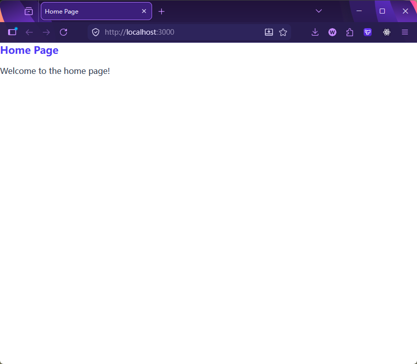

[← 返回章节首页](../../readme.md)

# Step 01：项目脚手架搭建

从零初始化 `backend/` 项目，搭建 Express + TypeScript + Tailwind CSS + SQLite 的完整开发环境骨架。

## 本步骤新增内容

- 初始化 `backend/` npm 项目，安装全部依赖
- 配置 `package.json` 启动脚本（`tsx watch` + Tailwind watch 并行）
- 配置 `tsconfig.json`
- 创建最基础的 `src/index.ts`（单个 GET `/` 路由）
- 创建最基础的 `views/home.ejs`（引入 Tailwind 输出样式）

## 启动方式

```bash
cd backend
npm install
npm run dev
# 访问 http://localhost:3000
```

## 安装依赖

```bash
npm install express @types/express ejs @types/ejs
npm install tailwindcss @tailwindcss/cli
npm install sqlite3 sqlite
npm install concurrently
```

> **前置条件：** 全局安装 `tsx`（只需一次）
> ```bash
> npm install -g tsx
> ```

## 关键配置：`package.json` 脚本

```json
"scripts": {
    "dev": "concurrently \"tsx watch ./src/index.ts\" \"npx @tailwindcss/cli -i ./public/css/input.css -o ./public/css/output.css --watch\"",
    "build": "tsc",
    "buildcss": "npx @tailwindcss/cli -i ./public/css/input.css -o ./public/css/output.css --minify"
}
```

`dev` 用 `concurrently` 同时运行两个 watch 进程：
- `tsx watch ./src/index.ts`：直接运行 TypeScript，文件变动自动重启
- `npx @tailwindcss/cli ... --watch`：监听 `input.css`，自动重新编译 CSS

## 目录结构

```
backend/
  src/
    index.ts        ← Express 入口，GET / 渲染 home.ejs
  views/
    home.ejs        ← 基础模板，引用 /css/output.css
  public/
    css/
      input.css     ← @import "tailwindcss"
      output.css    ← 编译生成，自动更新
    image/
  data/             ← 数据库目录（Step 02 开始使用）
  package.json
  tsconfig.json
```

## 本步骤成果


