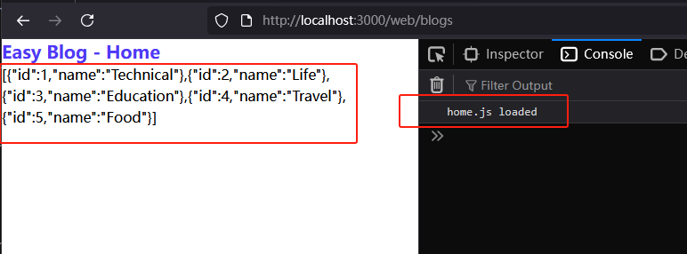
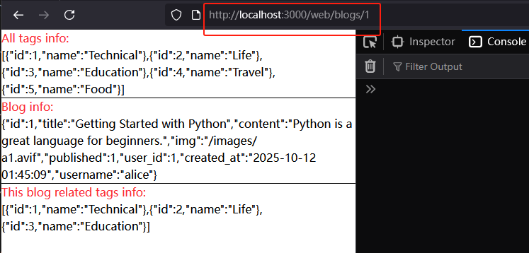

[← 返回章节首页](../../readme.md)

# Step 05：设计 Web 路由（SSR + CSR 混合）

在已有 API 路由的基础上，增加面向浏览器的 Web 路由层，实现页面渲染。

## 本步骤新增内容

- `src/routes/web/blogs.ts`：博客前台页面路由
- `src/routes/web/admin.ts`：管理后台路由（框架，暂无内容）
- `src/routes/web/index.ts`：barrel 导出
- `src/index.ts`：挂载 Web 路由，首页重定向
- `views/blog.ejs`：单篇博客页面模板（暂用 JSON.stringify 显示）
- `public/js/home.js`：占位脚本（暂只有 console.log）

## SSR + CSR 混合设计

本项目的 Web 页面采用混合渲染策略：

| 内容 | 渲染方式 | 原因 |
|---|---|---|
| 导航栏标签列表（tags） | **SSR**（服务端查询，传给 EJS） | 标签变动不频繁，无需动态刷新 |
| 博客列表 | **CSR**（页面加载后由 JS 请求 API） | 需要分页切换，不刷新页面 |
| 单篇博客内容 | **SSR** | 内容固定，利于 SEO |

## Web 路由实现

```typescript
// routes/web/blogs.ts
router.get('/', async (req, res) => {
    const tags = await getAllTags();               // SSR：服务端查 tags
    res.render('home.ejs', {
        title: 'Easy Blog - Home',
        script_name: 'home.js',                   // 告诉 EJS 加载哪个前端脚本
        tags                                      // tags 直接渲染进模板
    });
    // 博客列表不在这里查，由浏览器加载 home.js 后自行 fetch /api/blogs
});

router.get('/:id', async (req, res) => {
    const tags  = await getAllTags();
    const blog  = await getBlogById(id);          // SSR：服务端查博客内容
    const blogTags = await getTagsByBlogId(id);
    res.render('blog.ejs', { title, tags, blog, blogTags });
});
```

## `src/index.ts` 新增配置

```typescript
import { blogs as webBlogsRoute, admin as webAdminRoute } from "./routes/web/index.ts";

app.get("/", (req, res) => { res.redirect("/web/blogs"); });  // 首页重定向

app.use("/web/blogs", webBlogsRoute);
app.use("/web/admin", webAdminRoute);
```

## 本步骤成果

此时页面已可访问，SSR 的内容（tags、博客内容）直接显示，CSR 的博客列表部分暂用 `JSON.stringify` 打印原始数据。

- 首页（tags SSR + blogs CSR 占位）

  

- 单篇博客页（全 SSR）

  
