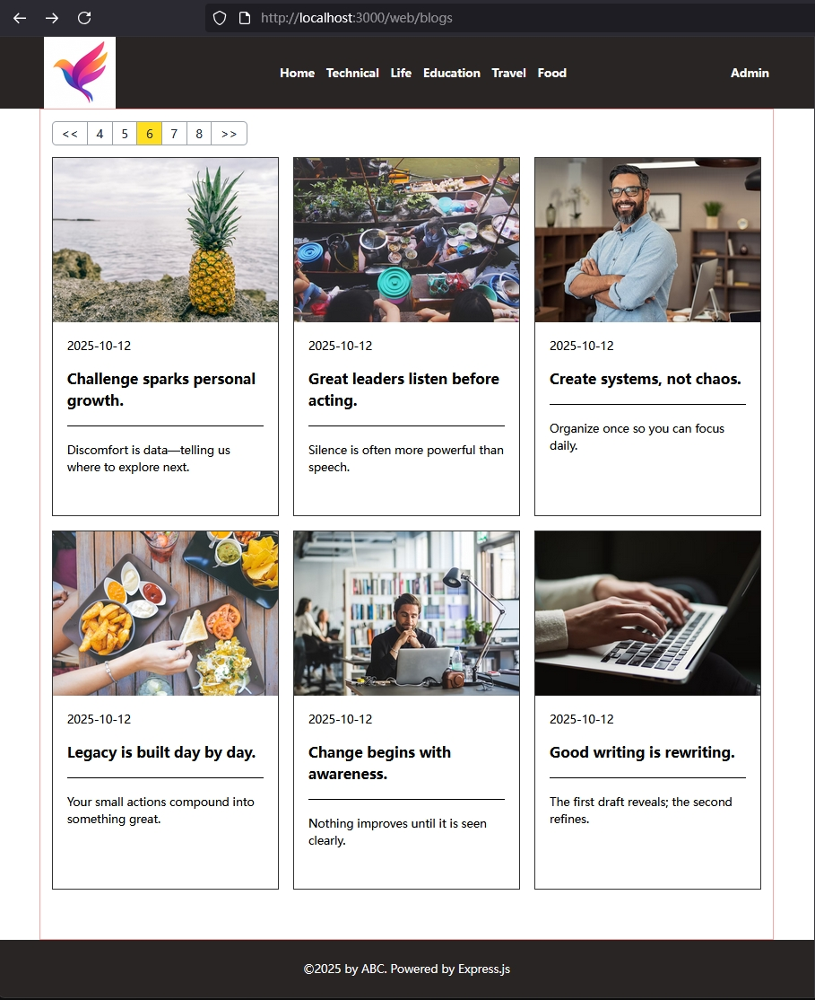
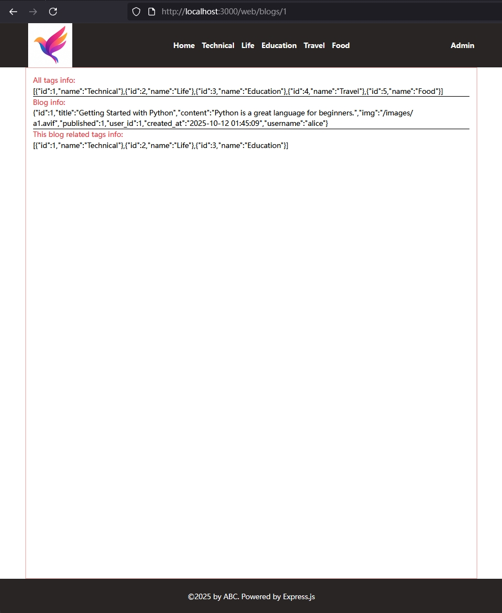
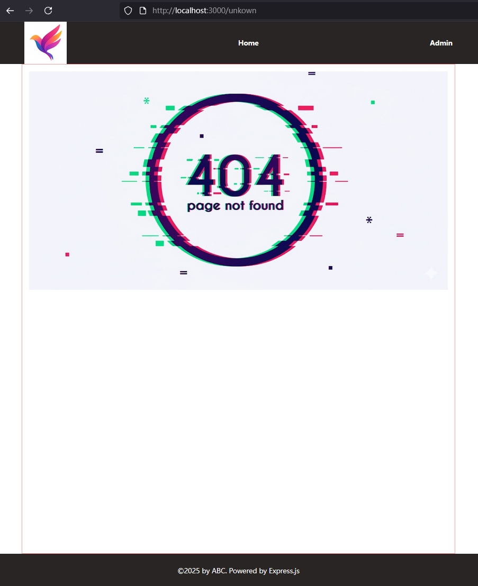

[← 返回章节首页](../../readme.md)

# Step 06：前台首页页面实现

完善博客首页的 CSR 渲染、EJS 模板分拆，并实现分页功能。

## 本步骤新增内容

- `frontend/src/home.ts`：博客列表的 CSR 脚本（fetch + DOM 渲染）
- `frontend/src/tools.ts`：`renderPagination` 分页工具函数（供多个页面复用）
- `frontend/src/elements.ts`：共享 DOM 元素引用
- `frontend/src/types.ts`：前端用的 TypeScript 接口
- `frontend/tsconfig.json`：将 `frontend/src/` 编译到 `backend/public/js/`
- `views/partial/header.ejs`、`views/partial/footer.ejs`：抽取公共部分
- `views/home.ejs`、`views/error.ejs`：更新为 include partial 写法

## 前端 TypeScript 编译流程

```
frontend/src/*.ts  ──tsc -w──►  backend/public/js/*.js  ──Express static──►  浏览器
```

在 `frontend/` 目录中运行 `tsc -w`，将 TypeScript 编译为 JavaScript 到 `backend/public/js/`，EJS 模板通过 `<script src="/js/home.js">` 加载。

## EJS Partials（模板复用）

将 header 和 footer 抽取为独立文件，在每个页面中 include：

```ejs
<%- include('partial/header', { title, tags, script_name }) %>

<!-- 页面主体内容 -->

<%- include('partial/footer') %>
```

## `frontend/src/home.ts`：博客列表 CSR

```typescript
async function fetchAndRenderBlogs(limit = 6, offset = 0) {
    const response = await fetch(`/api/blogs?limit=${limit}&offset=${offset}`);
    const blogs = await response.json();
    blogGrid.innerHTML = blogs.data.map(blogToHtml).join("");
    renderPagination({ total: blogs.total, limit, offset, pagination, fetchAndRenderBlogs });
}
document.addEventListener("DOMContentLoaded", () => { fetchAndRenderBlogs(); });
```

## 分页算法（`frontend/src/tools.ts`）

分页按钮只显示当前页附近的 5 个，避免页数过多时按钮爆满：

```typescript
let currentPage = Math.floor(offset / limit) + 1;
let totalPages  = Math.ceil(total / limit);
let startPage   = currentPage - 2;          // 尽量让当前页居中
if (startPage < 1) startPage = 1;
let endPage     = startPage + 4;
if (endPage > totalPages) {
    endPage   = totalPages;
    startPage = Math.max(endPage - 4, 1);   // 到尾部时向前补齐
}
```

`renderPagination` 接受 `fetchAndRenderBlogs` 作为回调，点击分页按钮时调用它刷新内容，不触发页面跳转。该函数设计为可复用——后续的 tag 过滤页面同样调用它（Step 08）。

## 本步骤成果

- 首页

  

- 单篇博客页（样式待完善）

  

- 404 页

  
