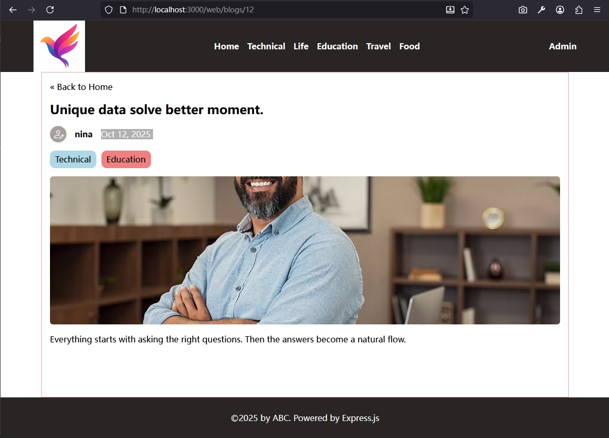

[← Back to Chapter Home](../../readme.md)

# Step 07: Single Blog Post Page Styling

Refine the EJS template and CSS styles for the single blog post page so content renders with proper layout.

## What's New in This Step

- `views/blog.ejs`: Replace the `JSON.stringify` placeholder with a proper HTML structure for rendering blog content
- `public/css/input.css`: Add Tailwind custom styles for the blog post page

## Data Source for the Single Blog Post Page

All data for the blog post page is queried server-side and passed into EJS (SSR); no client-side script is needed:

```ejs
<%- include('partial/header', { title, tags }) %>

<article>
    <h1><%= blog.title %></h1>
    <p><%= blog.created_at %> · <%= blog.username %></p>
    " alt="cover">
    <div><%= blog.content %></div>

    <!-- Blog tags (queried by getTagsByBlogId and passed in) -->
    <% blogTags.forEach(tag => { %>
        <span><%= tag.name %></span>
    <% }) %>
</article>

<%- include('partial/footer') %>
```

## Results

- Single blog post page

  
