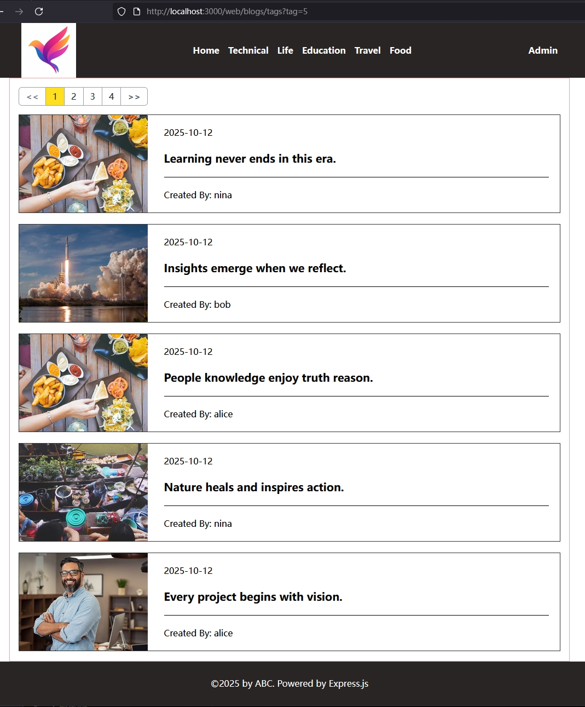

[← 返回章节首页](../../readme.md)

# Step 08：按标签过滤的博客列表页

新增一个按 tag 过滤博客的页面，复用首页的 EJS 模板，编写对应的前端脚本。

## 本步骤新增内容

- `src/routes/web/blogs.ts`：新增 `/web/blogs/tags?tag=:id` 路由
- `frontend/src/tag.ts`：按 tag 过滤的 CSR 脚本
- `views/partial/header.ejs`：更新导航条中 tag 链接的 href
- `public/css/input.css`：调整布局样式

## Web 路由

```typescript
router.get('/tags', async (req, res) => {
    const tag  = Number(req.query.tag);
    const tags = await getAllTags();
    // 从已查出的 tags 中找到当前 tag 的名称，用于页面标题
    const tagName = tags.find(t => t.id === tag)?.name || 'Unknown';
    res.render('home.ejs', {
        title: `Easy Blog - ${tagName}`,
        script_name: 'tag.js',     // 加载 tag.js 而不是 home.js
        tags
    });
    // 博客列表由 tag.js 自行 fetch /api/blogs/tag/:tag
});
```

> **注意路由顺序：** `/tags` 必须定义在 `/:id` 之前，否则 Express 会把 `tags` 当作 `:id` 参数匹配。

## `frontend/src/tag.ts`：复用分页工具

```typescript
async function fetchAndRenderBlogsByTag(limit, offset, tag?) {
    const response = await fetch(`/api/blogs/tag/${tag}?limit=${limit}&offset=${offset}`);
    const blogs = await response.json();
    blogByTagList.innerHTML = blogs.data.map(blogTagToHtml).join("");
    renderPagination({ total: blogs.total, limit, offset, pagination, tag,
                       fetchAndRenderBlogs: fetchAndRenderBlogsByTag });
}

document.addEventListener("DOMContentLoaded", () => {
    // 从 URL 读取 tag 参数：/web/blogs/tags?tag=1
    const tag = new URLSearchParams(window.location.search).get("tag");
    tag ? fetchAndRenderBlogsByTag(5, 0, tag) : (blogByTagList.innerHTML = "<h2>No tag specified.</h2>");
});
```

`renderPagination` 接受可选的 `tag` 参数并透传给回调，因此首页和标签页可以共用同一个分页工具函数。

## 本步骤成果

- 按标签过滤的页面

  
