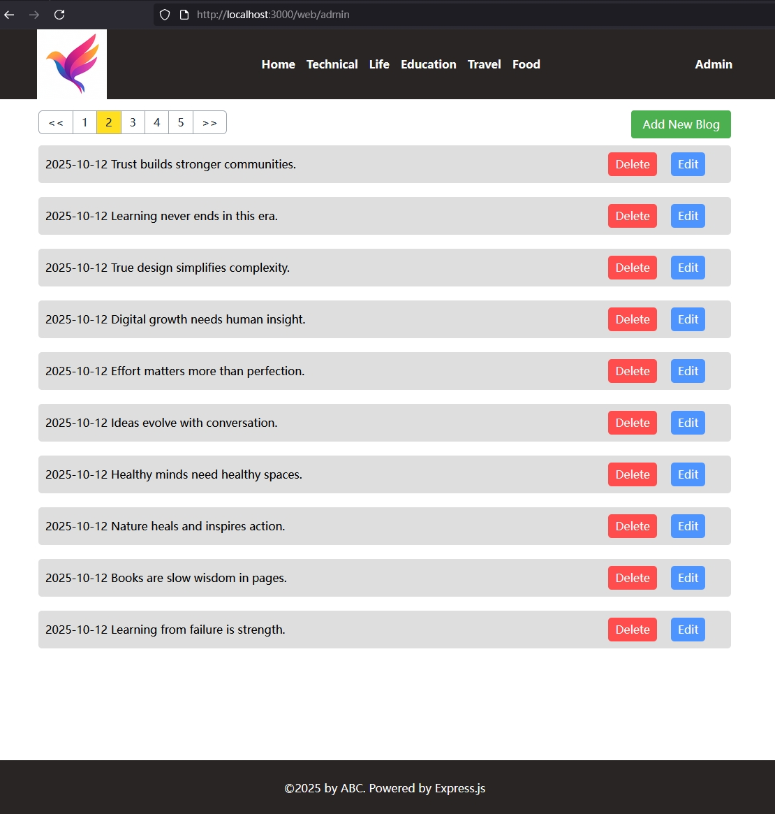
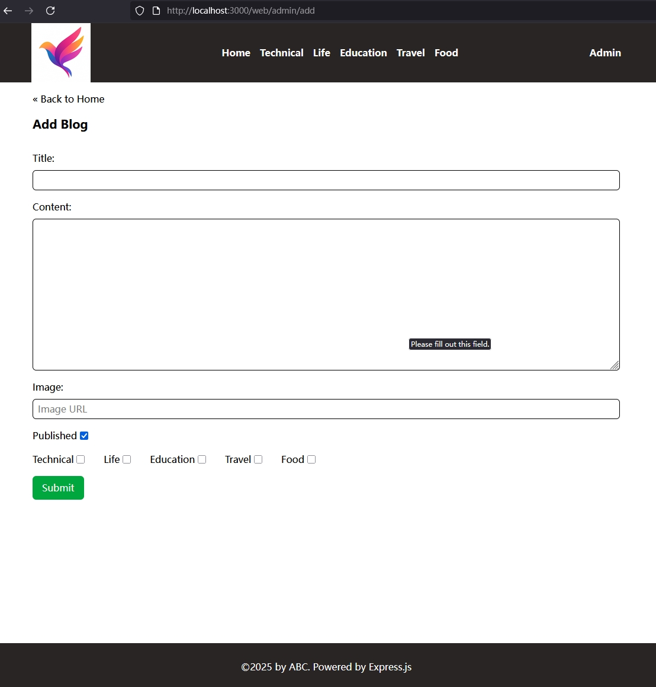
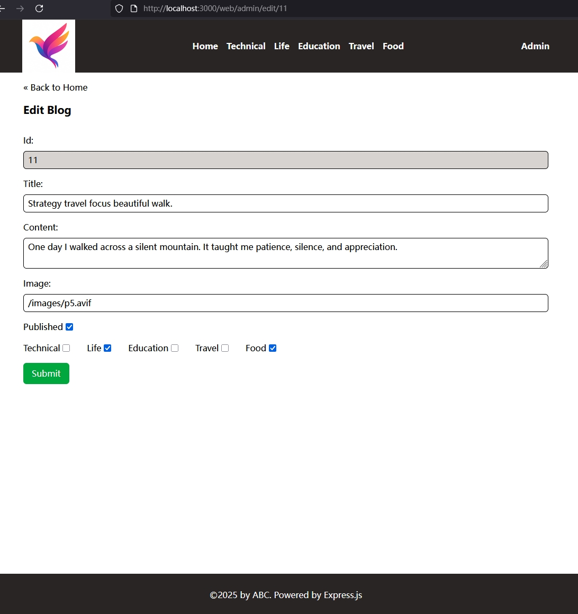
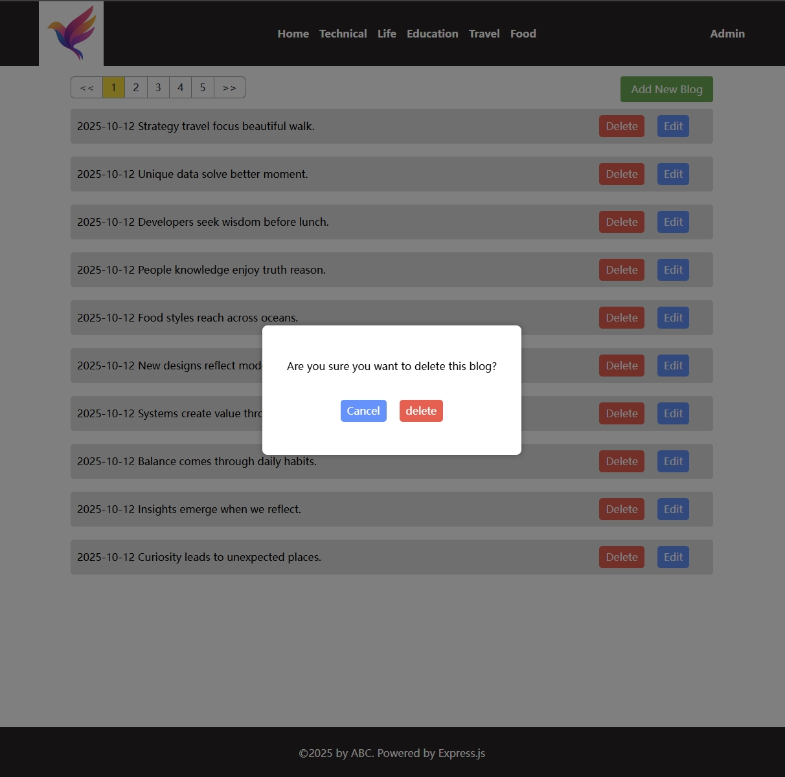

[← Back to Chapter Home](../../readme.md)

# Step 09: Admin Dashboard Pages

Implement the blog management interface for administrators: list view, create, and edit functionality.

## What's New in This Step

- `src/routes/web/admin.ts`: Admin page routes (3 routes)
- `frontend/src/admin_home.ts`: Admin homepage CSR script (blog list + delete)
- `frontend/src/admin_add_blog.ts`: Form interaction script for the create blog page
- `frontend/src/admin_edit_blog.ts`: Form interaction script for the edit blog page
- `views/addBlog.ejs`: Create blog form page
- `views/editBlog.ejs`: Edit blog form page

## Web Routes

```typescript
// Admin homepage: CSR, loads admin_home.js to display the blog list
router.get('/', async (req, res) => {
    const tags = await getAllTags();
    res.render('home.ejs', { title: 'Admin Dashboard', tags, script_name: 'admin_home.js' });
});

// Create blog page: SSR renders the form (tags used to render the checkbox list)
router.get('/add', async (req, res) => {
    const tags = await getAllTags();
    res.render('addBlog.ejs', { title: 'Add Blog', tags, script_name: 'admin_add_blog.js' });
});

// Edit blog page: SSR, server queries the current blog content to pre-fill the form
router.get('/edit/:id', async (req, res) => {
    const tags    = await getAllTags();
    const blog    = await getBlogById(blogId);
    const blogTags = await getTagsByBlogId(blogId);
    // Convert tags to an array of IDs so EJS can determine which checkboxes to check
    const blogWithTags: BlogWithTags = { ...blog, tags: blogTags.map(tag => tag.id) };
    res.render('editBlog.ejs', { title: 'Edit Blog', tags, script_name: 'admin_edit_blog.js', blog: blogWithTags });
});
```

## CSR vs SSR Design Decisions

| Page | Approach | Reason |
|---|---|---|
| Admin homepage (blog list) | CSR | Requires pagination; delete operations call the API via JS |
| Create blog form | SSR | Form structure is static; only the submit action needs JS |
| Edit blog form | SSR | Current blog data must be queried server-side to pre-fill fields |

## Results

- Admin homepage (blog list + action buttons)

  

- Create blog page

  

- Edit blog page

  

- Bonus: Custom delete confirmation modal (overlay)

  
