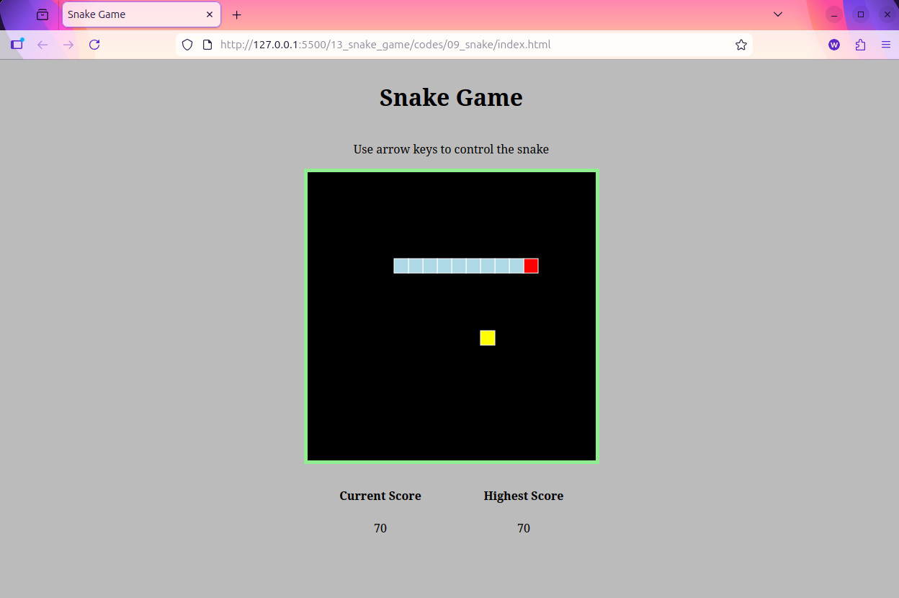

[← Back to Home](../readme.md)

# Chapter 13: Snake Game — Introduction to Object-Oriented Programming

Build a classic Snake game to systematically learn object-oriented programming (OOP) concepts, master the HTML5 Canvas 2D drawing API, and explore the BOM `localStorage` API.

The project is built across **9 progressive steps**: starting from the simplest Canvas drawing, gradually introducing classes, enums, the game loop, and collision detection, finishing with a complete game that persists the high score.

## Tech Stack

- **TypeScript** (compiled to JS, runs in the browser)
- **HTML5 Canvas 2D API**
- **BOM `localStorage`** (data persistence)
- No frameworks or external dependencies

## Project Structure

```
13_snake_game/
  codes/
    01_snake/ ~ 09_snake/  ← 9 progressive steps, each independently runnable
      index.html           ← Page (references script.js)
      script.ts            ← TypeScript source
      script.js            ← Compiled output (provided, ready to run)
      style.css
      tsconfig.json
  practice/                ← Exercise directory
    index.html             ← Page (complete, no modification needed)
    style.css              ← Styles (complete, no modification needed)
    tsconfig.json
    script.ts              ← Skeleton code, fill in TODOs to complete the game
```

## 9-Step Build Roadmap

| Step                                  | Core Content         | Key Concepts                                      |
| ------------------------------------- | -------------------- | ------------------------------------------------- |
| [Step 01](./codes/01_snake/readme.md) | Intro to Canvas      | getContext, fillRect, strokeRect, keydown         |
| [Step 02](./codes/02_snake/readme.md) | Keyboard-controlled dot | interface Point, redraw pattern, wrap-around   |
| [Step 03](./codes/03_snake/readme.md) | Class refactor       | class Snake, enum Direction, switch               |
| [Step 04](./codes/04_snake/readme.md) | Game loop + food     | setInterval, Food class, anti-reverse logic       |
| [Step 05](./codes/05_snake/readme.md) | Multi-segment body   | segments array, unshift + pop movement algorithm  |
| [Step 06](./codes/06_snake/readme.md) | Eating food to grow  | removeTail(), Array.some(), collision detection   |
| [Step 07](./codes/07_snake/readme.md) | Self-collision game over | checkCollisionWithSelf(), clearInterval       |
| [Step 08](./codes/08_snake/readme.md) | Scoreboard           | ScoreBoard class, DOM updates, textContent        |
| [Step 09](./codes/09_snake/readme.md) | High score persistence | localStorage.getItem / setItem                  |

## Exercise

The [`practice/`](./practice/readme.md) directory provides skeleton code for the complete game, keeping class structures and method signatures with the implementations replaced by TODO comments. Work through it following the 9-step roadmap, then compare with `codes/09_snake/script.ts` when done.

```bash
cd practice
tsc -w       # Watch mode: save to compile, then refresh the browser to see results
```

## How to Run

Each step directory already includes a compiled `script.js` — open `index.html` in a browser to run it directly.

To modify the TypeScript source, run in the corresponding directory:

```bash
tsc -w    # Watch mode: auto-compiles on save
```

## Final Result


