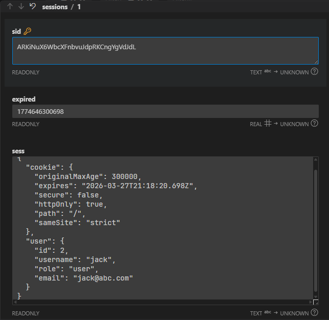

[← Back to Home](../readme.md)

# Chapter 16: HTTP Session Management — Session Exploration

This chapter is primarily **observation-based**. Rather than writing code from scratch, you will run the provided server and use browser DevTools, server logs, and the database file to witness the complete lifecycle of a Session firsthand.

## How to Start

```bash
cd codes
npm install

# SQLite version (primary demo)
npm run dev

# PostgreSQL version (comparison demo)
npm run dev-pg    # requires updating dbConfig in src/app-pg.ts first
```

Test accounts: `admin / cisco` (administrator), `jack / cisco` (regular user)

---

## 16.1 Why Do We Need Sessions?

HTTP is a **stateless protocol** — every request is a stranger to the server; it has no memory of who sent the previous request.

This creates a practical problem: after a user logs in, how does the next request tell the server "I'm still the same person from before"?

Common approaches:

| Approach | Method | Problem |
|---|---|---|
| Send credentials every time | Include `Authorization` header with each request | Password transmitted frequently, high security risk |
| Store user info in Cookie | Write userId directly into the Cookie | Client can tamper with it freely |
| Session | Server stores user info, Cookie only holds an ID | Secure — the ID itself carries no meaning |

**How Sessions work:**

```
1. User logs in successfully
      ↓
2. Server creates a Session record, stores it in the Session Store (database)
   Session content: { user: { id, username, role } }
      ↓
3. Server generates a random Session ID, sends it to the browser via Set-Cookie
   Set-Cookie: easyblog.sid=s%3Axxx...
      ↓
4. Browser automatically includes this Cookie in every subsequent request
   Cookie: easyblog.sid=s%3Axxx...
      ↓
5. Server receives the request, looks up the Session Store using the ID from the Cookie, restores user info
   → req.session.user now has data
```

---

## 16.2 Code Structure: A → Session Middleware → B

The middleware order in `app.ts` is the most important design decision in this chapter:

```
Request arrives
   │
   ▼
Logging middleware A    ← prints req state BEFORE session middleware
   │
   ▼
Session middleware      ← reads Cookie, queries Session Store, mounts data onto req.session
   │
   ▼
Logging middleware B    ← prints req state AFTER session middleware
   │
   ▼
Route handler
```

**Middleware A** focuses on the raw state of the request:

```typescript
console.log("req.headers: ", req.headers);         // raw headers sent by browser (including Cookie)
console.log("❌ req.sessionID: ", req.sessionID);  // still undefined at this point
console.log("❌ req.session: ",   req.session);    // still undefined at this point
```

**Middleware B** focuses on what the session middleware has mounted:

```typescript
console.log("✅ req.sessionID: ", req.sessionID);  // now has a value
console.log("✅ req.session: ",   req.session);    // now has structure; after login, contains user object
```

The two middlewares sandwiching the Session middleware clearly demonstrate: **`req.session` is dynamically injected onto the request object by the Session middleware — it does not come with the request itself**.

---

## 16.3 Session Middleware Configuration Explained

```typescript
app.use(session({
    secret: "topsecret",      // signing key, prevents client from forging Session IDs
    resave: false,            // don't re-save to store if session was not modified (reduces IO)
    saveUninitialized: false, // don't save anonymous sessions to store (saves space)
    name: "easyblog.sid",     // Cookie name; default is connect.sid

    cookie: {
        secure: false,        // true = HTTPS only (should be enabled in production)
        httpOnly: true,       // prevent frontend JS from reading this Cookie (anti-XSS)
        maxAge: 5 * 60 * 1000,// Cookie lifetime: 5 minutes
        sameSite: "strict"    // only sent with same-origin requests (anti-CSRF)
    },

    store: new SQLiteStore({  // persistent session storage
        db: 'sessions.db',
        table: 'sessions',
        dir: './db',
    }),
}));
```

### TypeScript Interface Extension

The default `SessionData` type from `express-session` does not include a `user` field. You need to add it using module augmentation:

```typescript
declare module "express-session" {
    interface SessionData {
        user?: {
            id: number;
            username: string;
            role: string;
            email: string;
        };
    }
}
```

This gives `req.session.user` proper TypeScript type checking.

---

## 16.4 Observation Exercise: Follow These Steps

### Step 1: First Visit (No Cookie)

Open the browser and visit `http://localhost:3000`. Observe:

**Server logs (Middleware A):**
```
req.headers: { host: 'localhost:3000', ... }
// Note: no Cookie field in headers
❌ req.sessionID: undefined
❌ req.session:   undefined
```

**Server logs (Middleware B):**
```
✅ req.sessionID: xxxxxxxxxxxxxxxxxxxxxxxx   ← randomly generated ID
✅ req.session:   Session { cookie: { ... } } ← empty session, no user
```

**Browser DevTools (F12 → Application → Storage → Cookies):**
- `easyblog.sid` is **not visible** in the Cookie list at this point — because `saveUninitialized: false`, anonymous sessions are not written to the store, and the server will not send a `Set-Cookie` response header

### Step 2: Multiple Refreshes (Not Logged In)

Refresh the page several times and observe the logs:
- **When not logged in, the `sessionID` is different on every request** — although the browser sends the Cookie, there is no matching record in the store, so the Session middleware generates a new ID each time

### Step 3: Log In

Visit `/login`, enter `admin / cisco`, log in successfully, and observe:

**Server logs:**
```
✅ req.session: Session {
    cookie: { ... },
    user: { id: 1, username: 'admin', role: 'admin', email: 'admin@abc.com' }
}
```

**Browser DevTools (F12 → Application → Storage → Cookies):**
- After login, `easyblog.sid` **appears for the first time**, and this Session ID is simultaneously written to `sessions.db`

### Step 4: Refresh Again After Login

Refresh the page multiple times and observe:
- **sessionID stays the same** — the browser sends the Cookie, the Session middleware finds the matching record in the store, and `req.session.user` has a value
- In Middleware A's logs, `req.headers.cookie` shows the Cookie being automatically included

### Step 5: View the Database

Open `codes/db/sessions.db` using the VS Code SQLite Viewer extension or DataGrip, and inspect the `sessions` table:
- You can see the session record created during login
- Fields include: `sid` (Session ID), `sess` (session content in JSON format), `expired` (expiry time)



### Step 6: Log Out

Visit `/logout` and observe:

**Server:**
```typescript
req.session.destroy()  // deletes this session record from the store
res.clearCookie("easyblog.sid")  // tells the browser to clear the Cookie
```

**Browser Cookie:**
- `easyblog.sid` disappears
- Subsequent visits to `/profile` return 401 Unauthorized

---

## 16.5 Route Overview

| Route | Description |
|---|---|
| `GET /` | Home page, shows current sessionID and session content |
| `GET /login` | Login form (redirects to /profile if already logged in) |
| `POST /login` | Handles login; writes user to `req.session.user` on success |
| `GET /profile` | Protected page; returns 401 if not logged in |
| `GET /logout` | Destroys session + clears Cookie |

---

## 16.6 app-pg.ts: Switching to a PostgreSQL Store

`app-pg.ts` demonstrates the configuration change for switching the session store from SQLite to PostgreSQL. All other route logic is identical.

**SQLite version:**
```typescript
import connectSqlite3 from "connect-sqlite3";
const SQLiteStore = connectSqlite3(session);

store: new SQLiteStore({
    db: 'sessions.db',
    table: 'sessions',
    dir: './db',
})
```

**PostgreSQL version:**
```typescript
import connectPg from "connect-pg-simple";
const pgStore = connectPg(session);

store: new pgStore({
    pool,                       // pass in an existing pg.Pool instance
    createTableIfMissing: true, // automatically create the table
    tableName: "session"
})
```

The only switching point is the `store` field. **The Session middleware interface is unified** — adapters hide the differences of the underlying storage. This is a classic application of the Adapter pattern.

---

## 16.7 Choosing a Session Store: SQLite, PostgreSQL, or Redis?

| | SQLite | PostgreSQL | Redis |
|---|---|---|---|
| Use case | Local development, teaching demos | Small-to-medium apps, no extra services | Production, high concurrency |
| Performance | Low | Medium | Extremely high (in-memory, nanosecond access) |
| Automatic TTL expiry | Requires manual cleanup | Requires manual cleanup | Native support (`EXPIRE` command) |
| Deployment complexity | No installation needed | Requires PostgreSQL service | Requires Redis service |
| Horizontal scaling | Not supported | Limited | Easy |

**Why is Redis recommended for production?**

1. **Native TTL**: `EXPIRE session_id 1800` sets 30-minute auto-expiry — no need to periodically clean up expired sessions
2. **In-memory speed**: Every request reads the session; Redis's millions-of-QPS throughput far outperforms the disk IO of a database
3. **Data model fit**: A session is essentially `{ key: sessionID, value: JSON }` — key-value storage is a natural match
4. **Easy horizontal scaling**: Multiple servers can share a single Redis instance, effortlessly supporting load balancing

**Recommended data storage breakdown:**

| Data type | Storage solution |
|---|---|
| User profiles / orders / articles | PostgreSQL |
| Login state (Session) | Redis (`connect-redis`) |
| API caching / rate limiting counters | Redis |
