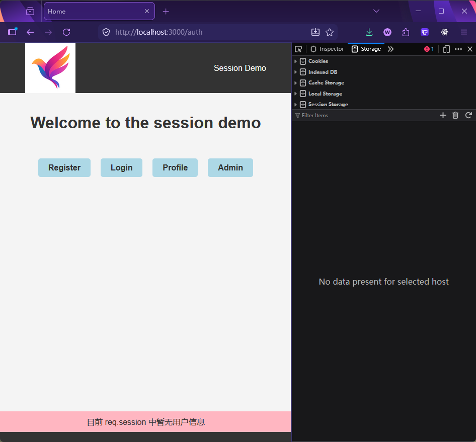
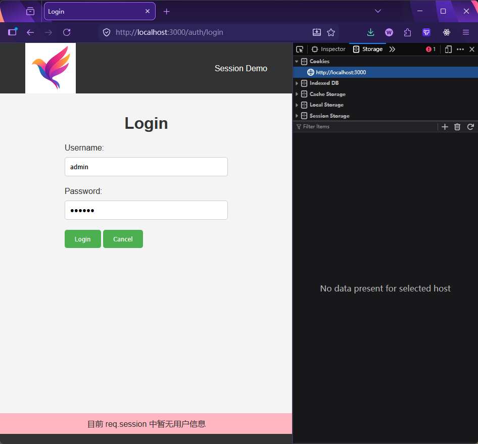
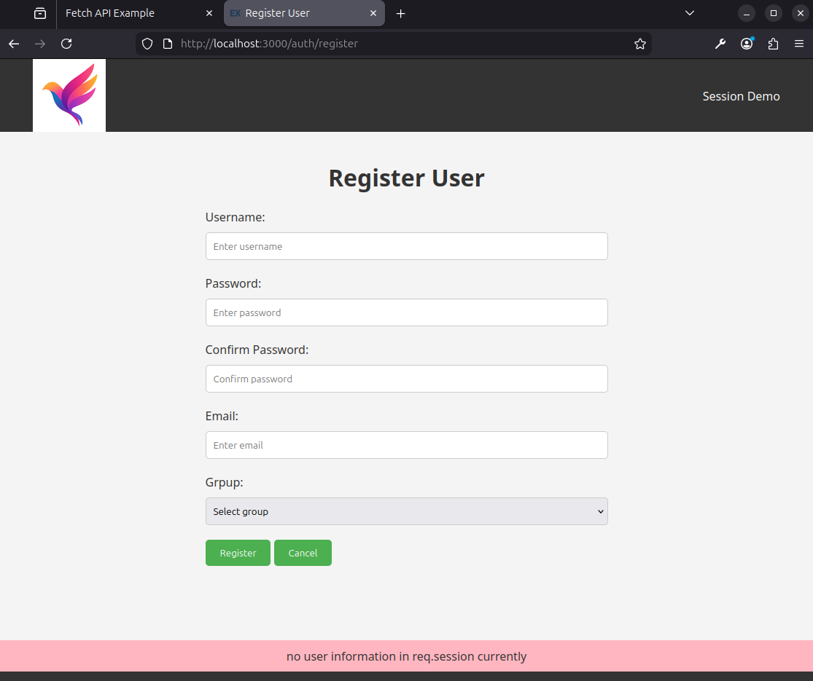
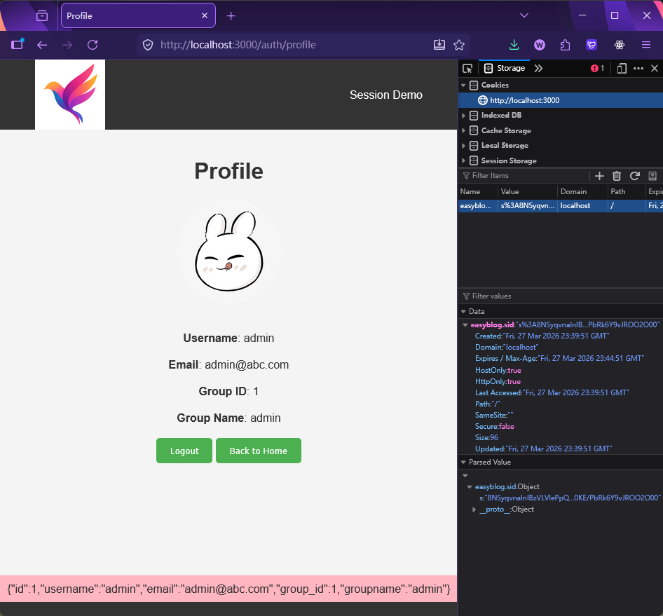
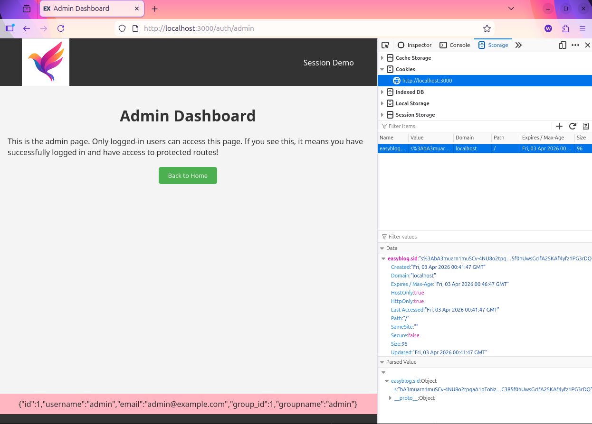
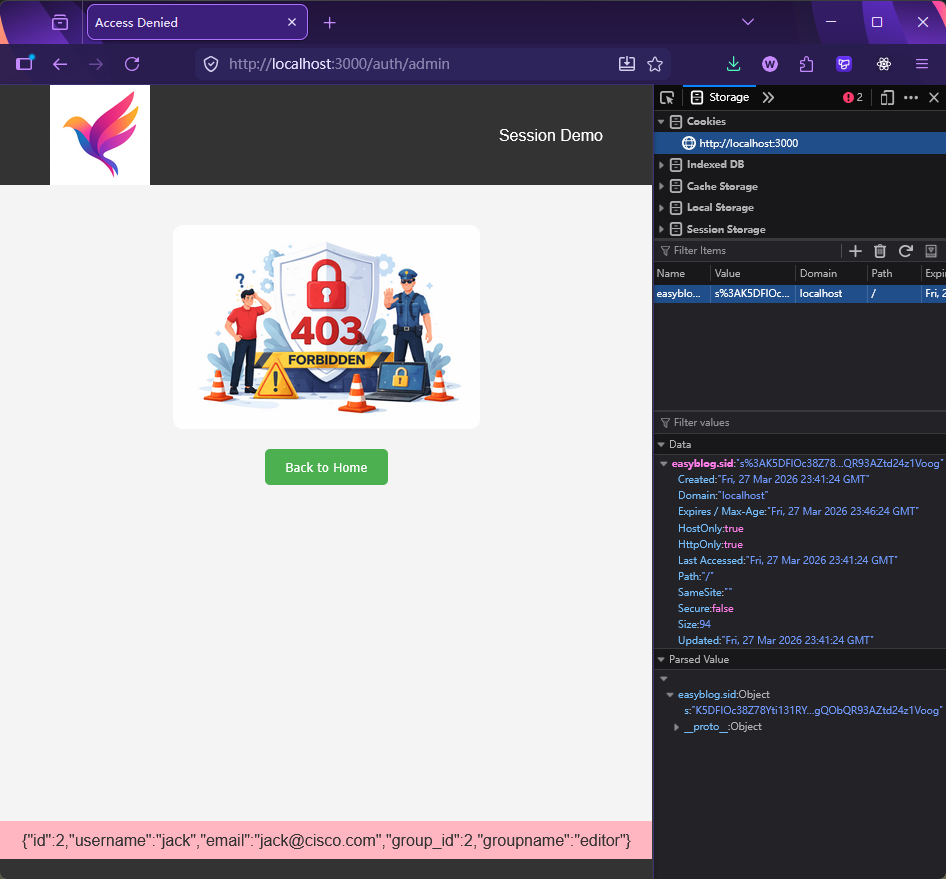

[← Back to Home](../readme.md)

# Chapter 16 (Advanced): Session-Based User Authentication System

This chapter is a complete applied example of Sessions: building a user authentication system with registration, login, and access control from scratch.

Tech stack: Express + TypeScript (tsx) + SQLite + EJS + bcrypt + express-session

## How to Start

```bash
# Backend
cd codes/backend
npm install
npm run dev

# Frontend (open a second terminal)
cd codes/frontend
tsc -w
```

Visit `http://localhost:3000`

---

## Design Approach: API First, Then UI

The development order in this chapter is intentionally arranged as: **write the API endpoints first, verify them with `api_test.http`, then build the frontend pages**.

Benefits of this approach:

- API logic and UI logic are decoupled — easy to pinpoint where issues are
- Once the API is debugged, the frontend only needs to focus on `fetch` calls and UI interactions

---

## 16.1 Project Structure

```
16_session_pro/
  codes/
    backend/
      src/
        app.ts                    ← Entry: middleware + route mounting
        db/
          ConnectionManager.ts    ← Auto-initializes the database (key component)
          users.ts                ← createUser / checkPassword (includes bcrypt)
          groups.ts               ← getAllGroups
        routes/
          api_auth.ts             ← POST /api/auth/register + /api/auth/login
          auth.ts                 ← Web routes (includes isAuthenticated / isAdmin guards)
        utils/
          authCheck.ts            ← isAuthenticated / isAdmin middleware
          shutdownConnection.ts   ← Graceful shutdown
      views/                      ← EJS templates
      public/js/                  ← Compiled frontend output
      data/
        db.sqlite                 ← User database (auto-creates tables)
        sessions.db               ← Session store
    frontend/
      src/
        login.ts                  ← Login form fetch script
        register.ts               ← Registration form fetch script
      tsconfig.json               ← Compiles to backend/public/js/
  api_test.http                   ← API testing (VS Code REST Client)
```

---

## 16.2 ConnectionManager: Auto-Initializing the Database

This chapter features an upgraded `ConnectionManager`. Its biggest difference from previous chapters is: **on first connection, it automatically creates tables and inserts initial data** — no need to manually run SQL scripts beforehand.

```typescript
export class ConnectionManager {
  private static db: Database | null = null;

  private static async initializeSchema(db: Database): Promise<void> {
    await db.exec("PRAGMA foreign_keys = ON;");

    // Create tables (if they don't exist)
    await db.exec(`
      CREATE TABLE IF NOT EXISTS groups ( ... );
      CREATE TABLE IF NOT EXISTS users  ( ... );
    `);

    // Insert initial group data (if the groups table is empty)
    const groupCount = await db.get("SELECT COUNT(*) as count FROM groups");
    if (!groupCount || groupCount.count === 0) {
      await db.run("INSERT INTO groups (name) VALUES (?), (?), (?)", ["admin", "editor", "user"]);
    }
  }

  public static async getConnection(): Promise<Database> {
    if (!this.db) {
      this.db = await open({ filename: "./data/db.sqlite", driver: sqlite3.Database });
      await this.initializeSchema(this.db); // ← only runs on first connection
    }
    return this.db; // singleton: subsequent calls return the existing connection
  }

  public static async closeConnection(): Promise<void> {
    if (this.db) {
      await this.db.close();
      this.db = null;
    }
  }
}
```

**Key design points:**

| Feature | Description |
| --- | --- |
| Singleton pattern | `private static db` ensures only one connection globally |
| Auto table creation | `CREATE TABLE IF NOT EXISTS` ensures idempotency |
| Auto initial data | COUNT before INSERT to avoid duplicate insertion |
| Graceful shutdown | `shutdownConnection.ts` calls `closeConnection()` on SIGINT/SIGTERM |

---

## 16.3 Password Encryption: bcrypt

Plaintext passwords must never be stored in the database. This chapter uses `bcrypt` for **one-way hashing**:

```typescript
import bcrypt from "bcrypt";
const saltRounds = 12; // hashing strength — higher is slower but more secure

// During registration: hash the password
const hashedPassword = await bcrypt.hash(password, saltRounds);
await db.run("INSERT INTO users (..., password, ...) VALUES (..., ?, ...)", [hashedPassword]);

// During login: compare passwords
const isMatch = await bcrypt.compare(plainTextPassword, hashedPasswordFromDB);
// bcrypt.compare handles the salt internally — just compare directly
```

**Why not use MD5 or SHA?**

- MD5/SHA are general-purpose hash functions — very fast, and easily cracked with rainbow tables
- bcrypt has a built-in random salt and allows tunable computation cost (`saltRounds`), designed specifically for passwords

**A useful trick in `checkPassword`:**

```typescript
// The query result includes the password field (hash), but it shouldn't be returned to the caller
const { password: _, ...userInfo } = user;
// Destructure to extract password into _ (convention for "unused")
// Collect remaining fields into userInfo and return safely
return userInfo;
```

---

## 16.4 API Routes: Write the API First

`src/routes/api_auth.ts` is mounted at `/api/auth`:

| Method | Path | Description |
| --- | --- | --- |
| POST | `/api/auth/register` | Register a new user, returns 201 on success |
| POST | `/api/auth/login` | Login; writes user info to `req.session.user` on success, returns 200 |

**The core line of the login endpoint:**

```typescript
const user = await checkPassword(username, password); // verify password
req.session.user = user; // write login state into session
res.status(200).json({ message: "Login successful", user });
```

From this point on, `req.session.user` will have a value in all subsequent requests that carry the Cookie.

Use `codes/backend/api_test.http` to test the endpoints without opening a browser.

---

## 16.5 authCheck: Authentication Middleware

With Sessions in place, route guards can be extracted as standalone middleware instead of repeating `if (!req.session.user)` in every route:

```typescript
// utils/authCheck.ts

export const isAuthenticated = (req, res, next) => {
  if (req.session.user) return next(); // logged in, proceed
  res.redirect("/auth/login"); // not logged in, redirect to login page
};

export const isAdmin = (req, res, next) => {
  if (req.session.user && req.session.user.group_id === 1) return next();
  res.status(403).render("error", {
    // no permission, return 403
    title: "Access Denied",
    image_name: "403.png",
    user: req.session.user,
  });
};
```

Use them directly as the second argument of a route:

```typescript
router.get("/profile", isAuthenticated, (req, res) => { ... });
router.get("/admin",   isAdmin,          (req, res) => { ... });
```

Comparing before and after the refactor:

```typescript
// ❌ Before refactor: repeated in every route
router.get("/profile", (req, res) => {
  if (!req.session.user) return res.redirect("/auth/login");
  res.render("profile", { ... });
});

// ✅ After refactor: middleware reuse
router.get("/profile", isAuthenticated, (req, res) => {
  res.render("profile", { ... });
});
```

---

## 16.6 Web Route Design

`src/routes/auth.ts` is mounted at `/auth`:

| Route | Guard | Description |
| --- | --- | --- |
| `GET /auth` | None | Home page, displays navigation links |
| `GET /auth/register` | None | Registration form (SSR, queries groups from DB to populate dropdown) |
| `GET /auth/login` | None | Login form; redirects to `/auth/profile` if already logged in |
| `GET /auth/profile` | `isAuthenticated` | Profile page, redirects to login if not authenticated |
| `GET /auth/admin` | `isAdmin` | Admin page, returns 403 for non-admins |
| `GET /auth/logout` | None | Destroys session + clears Cookie |

**Note the redirect-if-already-logged-in logic on `/auth/login`:**

```typescript
router.get("/login", (req, res) => {
  if (req.session.user) {
    res.redirect("/auth/profile"); // already logged in, don't show the login page
  } else {
    res.render("login", { ... });
  }
});
```

**The correct implementation of `/auth/logout`:**

```typescript
router.get("/logout", (req, res) => {
  req.session.destroy((err) => {
    // delete the record from the session store
    if (err) return res.status(500).send("Could not log out.");
    res.clearCookie("easyblog.sid"); // tell the browser to clear the Cookie
    res.redirect("/auth");
  });
});
```

---

## 16.7 Frontend Scripts: Fetch Interaction

The login and registration form pages do not use traditional `action`-based submission. Instead, frontend TypeScript scripts intercept the submit event and send a `fetch` request manually:

```typescript
// frontend/src/login.ts
loginForm.addEventListener("submit", async (event) => {
  event.preventDefault(); // prevent default submission (no page navigation)

  const formData = new FormData(event.target as HTMLFormElement);
  const data = {
    username: formData.get("username") as string,
    password: formData.get("password") as string,
  };

  const response = await fetch("/api/auth/login", {
    method: "POST",
    headers: { "Content-Type": "application/json" },
    body: JSON.stringify(data),
  });

  if (response.ok) {
    window.location.href = "/auth/profile"; // redirect on successful login
  } else {
    const { error } = await response.json();
    alert(error);
  }
});
```

**Frontend compilation config (`frontend/tsconfig.json`):**

```json
{
  "compilerOptions": {
    "outDir": "../backend/public/js"  ← compiled output goes directly to backend's static directory
  }
}
```

EJS templates reference the compiled JS:

```html
<script src="/js/login.js"></script>
← served by Express's static middleware
```

---

## 16.8 Page Screenshots

- Home page



- Login page



- Registration page



- Profile page



- Admin page (with permission)



- Admin page (without permission)


