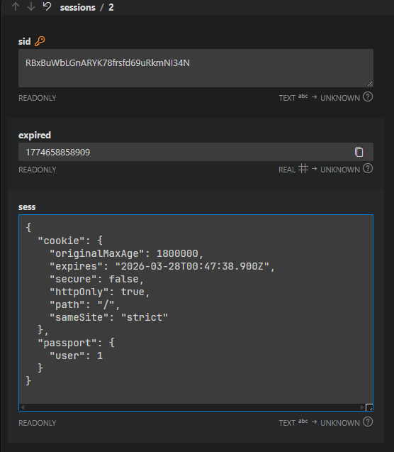

[← Back to Home](../readme.md)

# Chapter 17: Passport.js Authentication Middleware

This chapter builds on the Session foundation from Chapter 16, introducing Passport.js to gain a deep understanding of how authentication middleware collaborates with Sessions. The focus is on observing and understanding the **serialize / deserialize** mechanism.

Tech stack: Express + TypeScript (tsx) + Passport.js + express-session + connect-sqlite3

## How to Start

```bash
cd codes
npm install

# Local strategy (app.ts)
npm run dev

# Google OAuth (app-google.ts, requires configuring config.ts)
npm run dev-google
```

Visit `http://localhost:3000`. Test accounts: `admin / cisco`, `jack / cisco`

---

## Learning Objectives for This Chapter

This chapter is primarily **observation-based — no hands-on implementation required**. Repeatedly test the following flows and observe the console logs and browser Session state:

1. Login → observe serialize logs
2. Visit a protected page → observe deserialize logs
3. Logout → observe the Session cleanup process

---

## 17.1 Introduction to Passport

Passport is an **authentication middleware** designed specifically for Node.js. Core characteristics:

- **Does not replace Session**: Passport depends on express-session for data storage; the two work together
- **Strategy pattern**: Abstracts different authentication methods (local username/password, Google OAuth, JWT, etc.) into independent "strategies" — the main code does not need to change
- **Unified interface**: Regardless of which strategy is used, the logged-in user is accessed via `req.user` after login, and login status is checked via `req.isAuthenticated()`

Comparison with the pure Session approach from Chapter 16:

| | Chapter 16 (pure Session) | Chapter 17 (Passport) |
| --- | --- | --- |
| Storing user in Session | `req.session.user = user` (entire object) | Only stores `user.id` (serialized by Passport) |
| Checking login status | Whether `req.session.user` exists | `req.isAuthenticated()` |
| Accessing current user | `req.session.user` | `req.user` |
| Adding more login methods | Requires heavy changes to main code | Register a new strategy; main code unchanged |

---

## 17.2 Installation and Middleware Configuration

```bash
npm install passport passport-local passport-google-oauth20
npm install @types/passport @types/passport-local @types/passport-google-oauth20
```

**Middleware mounting order (must not be reversed):**

```typescript
app.use(session({ ... }));           // 1. Start Session first
app.use(passport.initialize());      // 2. Initialize Passport
app.use(passport.session());         // 3. Enable Passport's Session support
```

`passport.initialize()` injects `isAuthenticated()`, `user`, `login()`, `logout()`, and other methods onto `req`. `passport.session()` automatically calls deserialize on every request, restoring the ID stored in the Session back into a full user object.

Properties and methods Passport mounts on `req`:

```typescript
req.isAuthenticated()  // check if logged in
req.user               // current logged-in user object (undefined when not logged in)
req.login(user, cb)    // manual login (used in API routes)
req.logout(cb)         // logout
```

---

## 17.3 Configuring the Local Strategy (LocalStrategy)

The purpose of a strategy is: **take the credentials submitted by the user and decide whether authentication succeeds or fails**.

```typescript
passport.use(
  "local",
  new LocalStrategy(
    {
      usernameField: "username", // form field name (default is username)
      passwordField: "password", // form field name (default is password)
    },
    (username, password, done) => {
      const user = findUser(username);

      if (!user) {
        return done(null, false, { message: "Username does not exist" }); // authentication failed
      }
      if (user.password !== password) {
        return done(null, false, { message: "Incorrect password" });      // authentication failed
      }

      return done(null, user); // authentication succeeded, pass in user object
    },
  ),
);
```

The three forms of the `done` callback:

| Call form | Meaning |
| --- | --- |
| `done(null, user)` | Authentication succeeded |
| `done(null, false, { message })` | Authentication failed (not an error) |
| `done(err)` | System error |

---

## 17.4 Serialization and Deserialization (Most Important!)

This is the biggest difference between Passport and pure Sessions, and the core concept of this chapter.

### The Problem: Why Not Store the Entire User Object in the Session?

Sessions are stored in a database. If the user object is large (containing avatars, permission lists, etc.), writing/reading large amounts of data to/from the Session store on every request is expensive. Moreover, user information can change (e.g., a nickname update), which means the Session would hold stale data.

### Passport's Solution: Store Only the ID

```typescript
// Serialize: after login, Passport asks "what should be stored in the Session?"
passport.serializeUser((user, done) => {
  done(null, (user as User).id); // store only the ID, e.g.: 1
});

// Deserialize: on every request, Passport asks "given the ID in the Session, give me the full user object"
passport.deserializeUser((id, done) => {
  const user = findUserById(id as number); // query latest data from database
  if (user) {
    return done(null, user);
  }
  return done(new Error("User not found"));
});
```

### The Complete Lifecycle

```
POST /login
  → LocalStrategy verifies, returns user object
  → serializeUser(user, done) is called
  → done(null, user.id)  →  Session stores { passport: { user: 1 } }
  → respond to client (Set-Cookie: easyblog.sid=...)

GET /profile (with Cookie)
  → express-session reads Session, finds { passport: { user: 1 } }
  → deserializeUser(1, done) is called
  → queries database for user with id=1 → done(null, user)
  → req.user = user (full user object)
  → req.isAuthenticated() returns true
  → route handler executes
```

Visual representation:

```
Browser                    Server                       Session Store
  |                          |                               |
  |-- POST /login ---------->|                               |
  |                     verified                             |
  |                   serializeUser                          |
  |                   store user.id=1                        |
  |                          |-------- write id=1 ---------->|
  |<-- Set-Cookie: sid=abc --|                               |
  |                          |                               |
  |-- GET /profile (sid=abc)->|                             |
  |                          |------- read sid=abc -------->|
  |                          |<------ { user: 1 } ----------|
  |                   deserializeUser(1)                     |
  |                   look up full user object               |
  |                   req.user = { id:1, username:"admin"...}|
  |<-- 200 Profile page -----|                               |
```

Observe the Session data structure in the database (`sessions` table in `db/sessions.db`):



The content stored in the Session looks like: `{"cookie":{...},"passport":{"user":1}}` — just one ID, not the complete user data.

---

## 17.5 The Login Flow

`passport.authenticate("local", options)` is a **function that returns middleware**. It internally calls the LocalStrategy and decides what to do next based on the result:

```typescript
// Form submission method (most concise)
app.post(
  "/login",
  passport.authenticate("local", {
    successRedirect: "/?message=Login successful",
    failureRedirect: "/login?error=Invalid username or password",
  }),
);
```

For API routes that need to return JSON rather than redirect, use the **manual callback approach**:

```typescript
app.post("/api/auth/login", (req, res, next) => {
  passport.authenticate("local", (err, user, info) => {
    if (err) return res.status(500).json({ error: "System error" });
    if (!user) return res.status(401).json({ error: info?.message });

    // manually call req.login() to write to Session
    req.login(user, (err) => {
      if (err) return res.status(500).json({ error: "Login failed" });
      res.json({ success: true, user });
    });
  })(req, res, next); // ← note: must be immediately invoked with req/res/next
});
```

Comparison of the two approaches:

| Approach | Use case | Session write |
| --- | --- | --- |
| `options` object | Form submission, redirect | Handled automatically by Passport |
| Manual callback | API, custom response needed | Must call `req.login()` manually |

---

## 17.6 Checking Login Status

Passport's guard syntax is cleaner than Chapter 16:

```typescript
// Chapter 16 (pure Session)
function isAuthenticated(req, res, next) {
  if (req.session.user) return next();
  res.redirect("/auth/login");
}

// Chapter 17 (Passport)
function isAuthenticated(req, res, next) {
  if (req.isAuthenticated()) return next(); // ← call the method directly
  res.redirect("/login?error=You must be logged in to access this page");
}

function isAdmin(req, res, next) {
  if (req.isAuthenticated() && (req.user as User).role === "admin") return next();
  res.redirect("/login?error=Admin privileges required");
}
```

Usage is unchanged:

```typescript
app.get("/profile", isAuthenticated, (req, res) => { ... });
app.get("/admin",   isAdmin,          (req, res) => { ... });
```

---

## 17.7 Logout

Logout requires three steps in the correct order:

```typescript
app.get("/logout", (req, res) => {
  // Step 1: Passport clears req.user and removes the passport field from the Session
  req.logout((err) => {
    if (err) return res.status(500).send("Logout failed");

    // Step 2: Destroy the entire Session (delete the record from the Session store)
    req.session.destroy((err) => {
      if (err) return res.status(500).send("Logout failed");

      // Step 3: Tell the browser to delete the Cookie
      res.clearCookie("easyblog.sid");
      res.redirect("/");
    });
  });
});
```

Why three steps?

- `req.logout()` only clears the in-memory authentication state; the Session record remains in the store
- `req.session.destroy()` actually deletes the Session record from the store
- `res.clearCookie()` tells the browser to delete the Cookie (otherwise the browser would keep sending requests with the now-invalid Cookie)

---

## 17.8 Google OAuth 2.0 (app-google.ts)

OAuth 2.0 is an **authorization protocol** that lets users log in with a third-party account (Google, GitHub, etc.) without registering a password on this site.

### Configuration Steps

1. Create a project in [Google Cloud Console](https://console.cloud.google.com/), enable OAuth 2.0 credentials
2. Set the callback URL: `http://localhost:3000/auth/google/callback`
3. Fill in the Client ID and Secret in `config.ts`

```typescript
// config.ts
export const config = {
  clientID: "replace-with-your-client-id.apps.googleusercontent.com",
  clientSecret: "replace-with-your-client-secret",
  callbackURL: "/auth/google/callback",
};
```

### GoogleStrategy Configuration

Unlike LocalStrategy, the Google strategy's callback parameters are the user info returned by OAuth (`profile`):

```typescript
passport.use(
  "google",
  new GoogleStrategy(
    {
      clientID: config.clientID,
      clientSecret: config.clientSecret,
      callbackURL: config.callbackURL,
    },
    async (accessToken, refreshToken, profile, done) => {
      const email = profile.emails?.[0]?.value;

      // Three-step lookup logic
      // 1. Find by Google ID → returning user who has previously logged in with Google
      let user = findUserByGoogleId(profile.id);
      if (user) return done(null, user);

      // 2. Find by email → user who registered with email but never used Google login
      if (email) {
        user = findUserByEmail(email);
        if (user) {
          user.googleId = profile.id; // link Google ID
          return done(null, user);
        }
      }

      // 3. Not found either way → brand new user, auto-register
      const newUser = createUser({
        username: profile.displayName,
        email: email || "",
        googleId: profile.id,
        provider: "google",
      });
      return done(null, newUser);
    },
  ),
);
```

### Google OAuth Routes

```typescript
// Initiate authorization: redirect to Google's authorization page
app.get(
  "/auth/google",
  passport.authenticate("google", {
    scope: ["profile", "email"], // request permission scopes
    prompt: "select_account",    // show account selection prompt
  }),
);

// Callback handler: Google redirects here after authorization is complete
app.get(
  "/auth/google/callback",
  passport.authenticate("google", {
    successRedirect: "/?message=Google login successful",
    failureRedirect: "/login?error=Google login failed",
  }),
);
```

### Complete OAuth 2.0 Flow

```
User clicks "Sign in with Google"
  → GET /auth/google
  → redirect to Google authorization page (accounts.google.com/...)

User approves authorization on Google's page
  → Google redirects back to GET /auth/google/callback?code=xxx
  → Passport exchanges code for accessToken
  → GoogleStrategy callback executes (find or create user)
  → serializeUser writes user.id into Session
  → redirect to home page
```

The serialize/deserialize logic is identical for Google users and local users: both store `user.id`, and every subsequent request restores the user via `findUserById`. This is the value of Passport's strategy pattern — regardless of the login method, the Session management code after that does not change at all.
