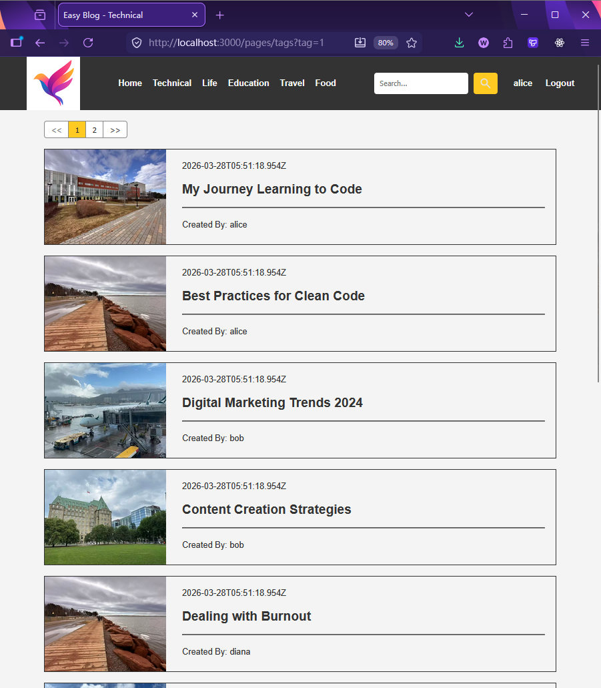
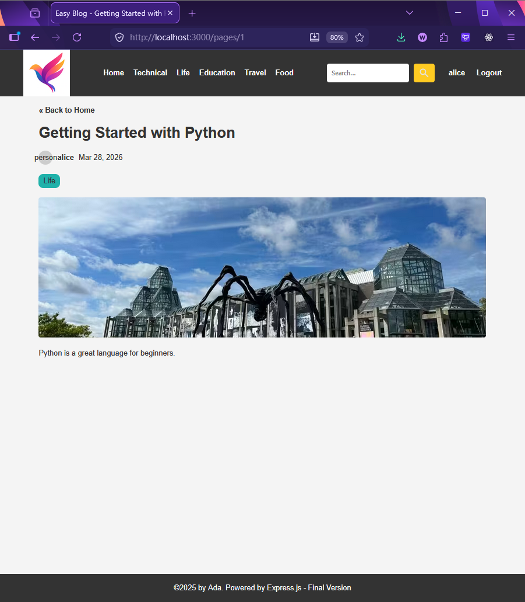
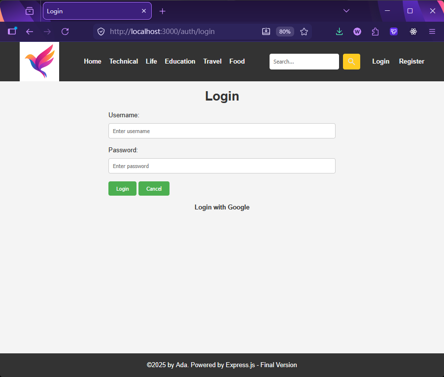
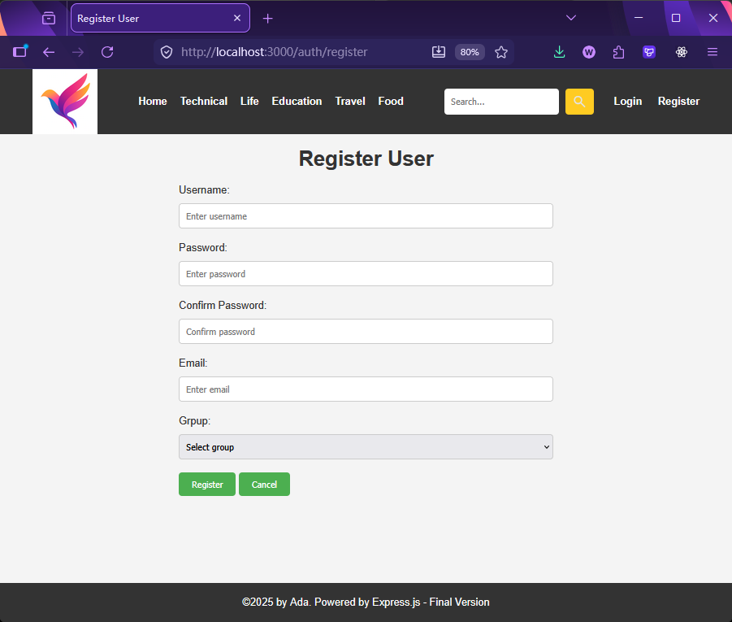
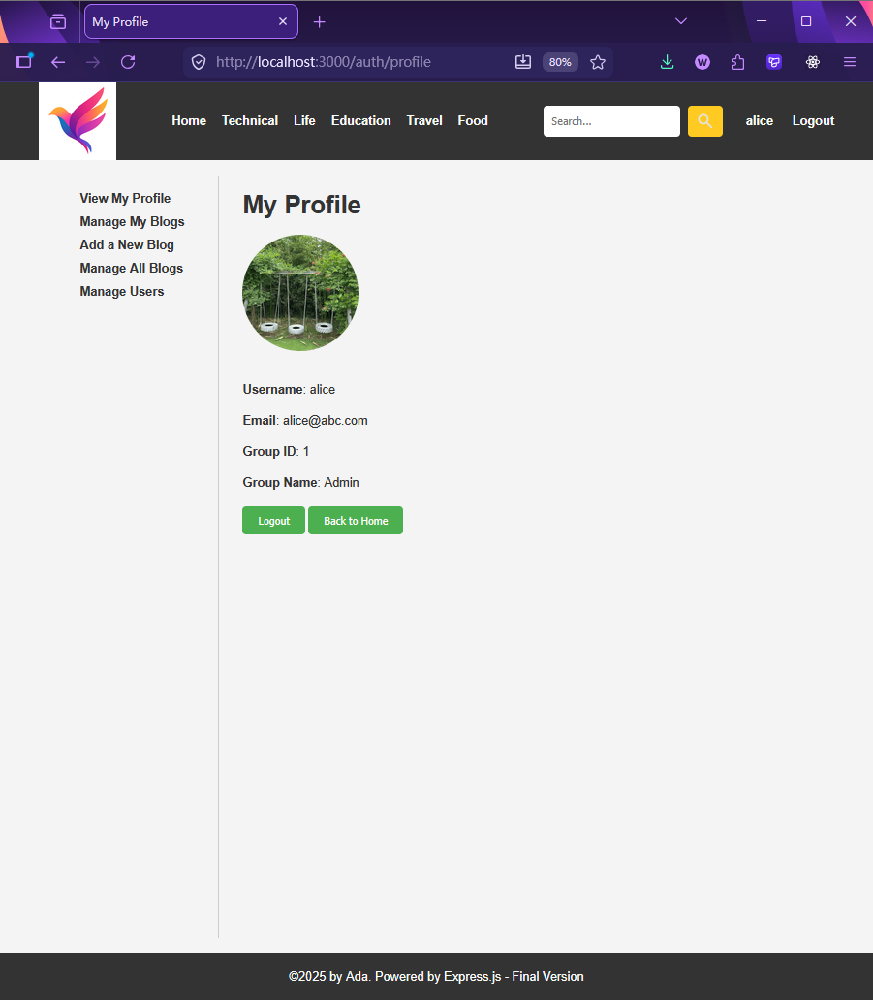
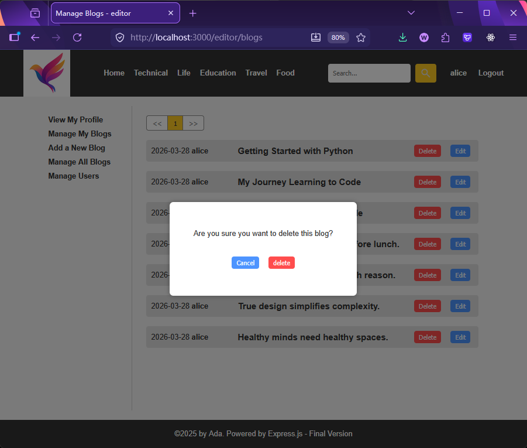
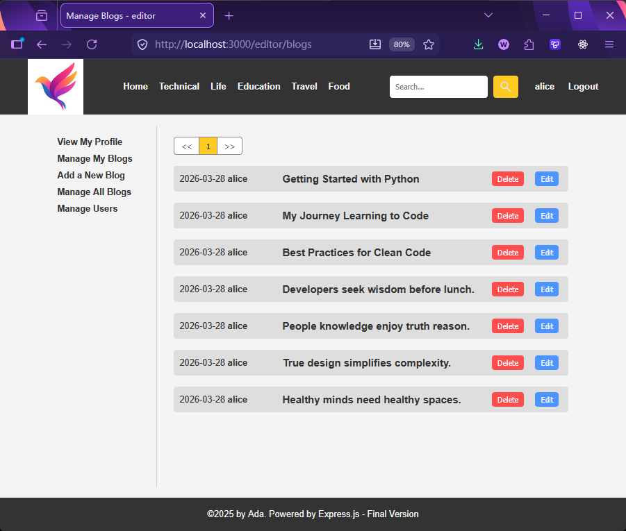
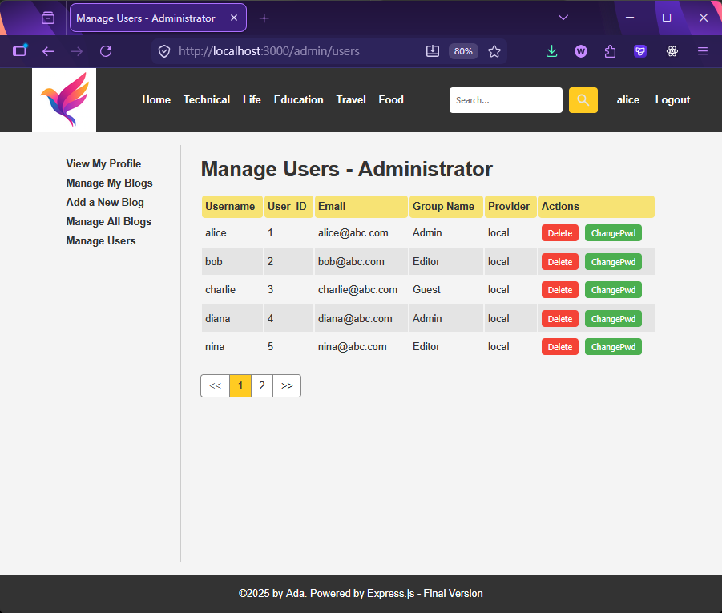

[← Back to Home](../readme.md)

# Chapter 19: EasyBlog Final — Capstone Project

This chapter is the final project of the entire course. Building on the PostgreSQL blog system, it adds user authentication, permission management, environment variable best practices, and a code structure organized around MVC principles.

The `codes/` directory provides a complete reference implementation for you to compare against.

---

## Project Showcase

**Home page**: Latest blogs pinned at the top + paginated blog list


**Filter by tag**: List of all blogs and authors under a given tag



**Blog detail**: Displays body content, author, and publish date



**Login / Register**




**User profile page**: Displays avatar, username, email, and group; left-side navigation shown dynamically based on permissions



**Editor / Admin — Manage My Blogs**: With delete confirmation dialog



**Admin — Manage All Blogs**



**Admin — Manage User List** (includes change password / delete)



---

## Project Requirements

### Functional Requirements

**Blog system**
- Home page shows latest blogs + paginated list
- Filter blogs by tag
- Blog detail page (displays content, author, tags)
- Logged-in users can create / edit / delete their own blogs
- Admins can delete any blog

**User authentication**
- Local registration / login (username + password, bcrypt hashing)
- Google OAuth 2.0 login
- Already-logged-in users visiting the login page are automatically redirected to the profile page

**Permission management**
Three user groups (`groups` table):

| group_id | name   | Permissions                                   |
| -------- | ------ | --------------------------------------------- |
| 1        | admin  | All permissions, including user management    |
| 2        | editor | Can publish blogs, can manage own articles    |
| 3        | guest  | Browse only, cannot publish                   |

**User management (admin only)**
- View all users list (paginated)
- Change user passwords
- Delete users (cannot delete self)

### Technical Requirements

| Category         | Requirement                                                                      |
| ---------------- | -------------------------------------------------------------------------------- |
| Database         | PostgreSQL, using `pg` package Pool mode                                         |
| Authentication   | `passport` + `passport-local` + `passport-google-oauth20`                       |
| Session          | `express-session` + `connect-pg-simple` (Sessions stored in PostgreSQL)          |
| Passwords        | `bcrypt` hashing; plaintext storage is forbidden                                 |
| Environment vars | `dotenv`; all sensitive information in `.env`; `.env` added to `.gitignore`      |
| Templating       | EJS (server-side rendering)                                                      |
| Frontend         | Vanilla TypeScript + Fetch API, compiled and served as static files              |

### Database Schema

```sql
groups      -- user groups (admin / editor / guest)
users       -- users (includes google_id, avatar, provider fields for OAuth support)
blogs       -- blog posts
tags        -- tags
blog_tags   -- blog-tag many-to-many join table
```

See `codes/backend/data/console.sql` for details.

---

## Project Structure

```
backend/
  src/
    env.ts              ← loads .env; must be the first import in app.ts
    config.ts           ← centralizes dbConfig and sessionConfig
    app.ts              ← middleware registration, route mounting, graceful shutdown
    db/                 ← database access layer (queries only; no business logic)
    models/             ← TypeScript interface definitions
    routes/
      api/              ← API routes returning JSON
      web/              ← page routes returning HTML
    utils/
      authCheck.ts      ← isAuthenticated / isAdmin middleware
      configPassport.ts ← Passport strategy configuration (Local + Google)
      shutdownConnection.ts ← graceful database connection shutdown
  views/                ← EJS templates
  public/               ← static assets (CSS, images, compiled frontend JS)
  data/console.sql      ← database schema and seed data script

frontend/
  src/                  ← frontend TypeScript source
  tsconfig.json         ← compile target: backend/public/js/

docker/
  docker-compose.yml    ← one-command PostgreSQL container startup
```

---

## How to Start

### 1. Start PostgreSQL (Docker)

The project includes a Docker Compose script; running it in WSL is recommended:

```bash
cd docker
docker compose up -d
```

This starts a PostgreSQL 16 container (port 5432), database name `db6`, persisted to Docker volume `pg_data`.

> Stop: `docker compose down`
> Stop and delete data: `docker compose down -v`

### 2. Configure Environment Variables

```bash
cd codes/backend
cp .env_example .env
# Edit .env and fill in your database connection info and Google OAuth credentials
```

See `.env_example` for example `.env` content.

### 3. Install Dependencies and Start the Backend

```bash
cd codes/backend
npm install
npm run dev
```

On startup, table creation and test data initialization run automatically (`initializeDatabase()`); no need to run SQL manually.

### 4. Compile the Frontend (Open a Second Terminal)

```bash
cd codes/frontend
tsc -w
```

Visit `http://localhost:3000`

> Built-in test accounts (all passwords are `123123`): `alice` (admin), `bob` (editor), `charlie` (guest), etc.

---

## Key Design Notes

**Layering principle**

- `db/*.ts` is only responsible for querying the database; it does not make business judgments on results (returns `undefined` when not found, throws exceptions on errors)
- `routes/*.ts` is responsible for business logic (null checks, permission validation, assembling responses)
- Each layer has a single responsibility and does not cross into the other's domain

**Passport serialization**

After login, the Session stores only `user.id`. On every subsequent request, `deserializeUser` reloads the full user data from the database. As a result, `req.user` always reflects the latest data.

**Google OAuth account merging logic**

1. Look up by `google_id` first → returning user who has previously logged in with Google
2. Then look up by email → user who registered with email but is using Google login for the first time; automatically linked
3. Not found either way → create a new user

---

## Closing Note

Completing this project means you have built a complete web application from the ground up — it has its own database, its own authentication system, its own frontend-backend interaction. You know exactly what happens behind every button and every page transition.

That kind of understanding is hard to come by if you skip this stage.

In today's frontend landscape, Vue and React have become almost the industry default. You may have noticed that many people learning web development open a framework's documentation as their very first step. They can put together a page quickly, but they often cannot explain how data flows, or why changing state doesn't update the view, or what to do when something slightly unusual goes wrong.

The reason is simple — they have never had a direct, face-to-face conversation with the browser.

You are different. You have manipulated the DOM with native APIs, handwritten Fetch requests, and implemented your own pagination and permission redirect logic. These things are tedious to do, and precisely because they are tedious, you truly understand what frameworks are doing on your behalf.

When you encounter Vue's reactivity system or React's component rendering for the first time, you will likely have a moment of clarity — not a mysterious magic trick, but something familiar expressed in a more elegant way.

A solid foundation is what lets you build higher.
