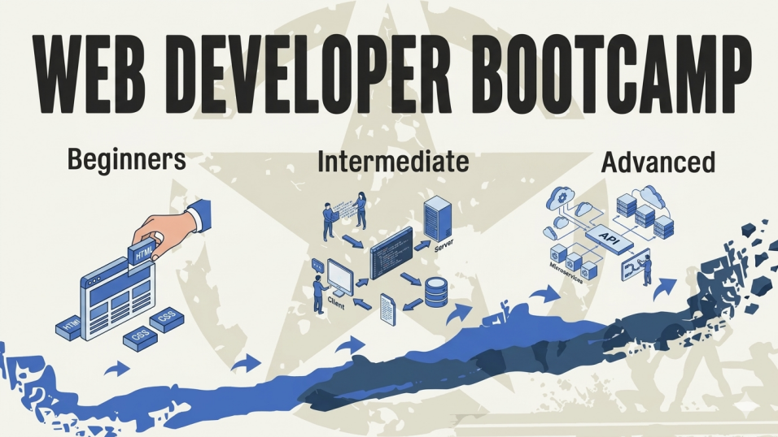

# From HTTP to Full-Stack Development — Web Developer Bootcamp



In the quiet flow of the World Wide Web, everything begins with a request that cannot be seen.

This book grew out of my notes from studying and teaching between 2024 and 2025. Those scattered notes, the explanations refined through repeated iteration, and the confusion and clarity found through hands-on practice have been rewoven, with the help of modern tools and collaboration, into a coherent series of chapters. It is both a retrospective and a new starting point.

Every line of text here stands on the shoulders of the open-source world. Knowledge comes from the internet, and it should return to the internet. These organized documents are therefore released openly, as a small contribution back to the open-source community.

This tutorial is aimed at beginners, but experienced explorers are welcome too. Starting from the underlying logic of the HTTP protocol, it gradually passes through key areas including server-side frameworks, data storage, and user authentication, ultimately arriving at a fully working blog system. Along the way, technology is no longer an isolated tool, but a path that can be understood, taken apart, and rebuilt.

I chose Node.js, TypeScript, and SQLite/PostgreSQL as the foundation, deliberately avoiding overly abstracted frameworks. No shortcuts to obscure the view — only clearer structure and underlying principles, where every detail is visible and every build has traceable origins.

---

## Table of Contents

- [Phase 1: Foundational Protocols and Native Development (Chapters 1–3)](#phase-1-foundational-protocols-and-native-development)
- [Phase 2: Full-Stack Front-End and Back-End Integration (Chapters 4–12)](#phase-2-full-stack-front-end-and-back-end-integration)
- [Phase 3: Deep Dive into Object-Oriented Programming (Chapter 13)](#phase-3-deep-dive-into-object-oriented-programming)
- [Phase 4: Production-Grade Databases (Chapters 14–15)](#phase-4-production-grade-databases)
- [Phase 5: User Authentication and Comprehensive Practice (Chapters 16–19)](#phase-5-user-authentication-and-comprehensive-practice)
- [Phase 6: Automated Testing (Chapters 20–21)](#phase-6-automated-testing)

---

## Phase 1: Foundational Protocols and Native Development

When learning web development, the first temptation is to start with a framework: install React or Vue, get a page moving, and it all seems very efficient. But frameworks are abstractions over underlying principles, and the cost of abstraction is this: when something goes wrong, you have no idea where to look. It's like living in a fully automated building where electricity, water, and heating are all system-controlled — when the power goes out, you find you don't even know where the fuse box is.

This phase starts with the HTTP protocol itself, because you need to read the "circuit diagram" first.

---

### Chapter 1: Linux Basics ([`01_linux_basic`](./01_linux_basic/README.md))

Code ultimately runs on servers, and servers typically run Linux. Before you start writing code, take a look at what that runtime environment looks like.

- Common Linux commands: file operations, permission management, process management
- Understanding the difference between SSR (Server-Side Rendering) and CSR (Client-Side Rendering)
- Understanding the role and use cases of Apache, PHP, and Node.js

---

### Chapter 2: HTTP Protocol Fundamentals ([`02_http_basic`](./02_http_basic/README.md))

Without using any framework, hand-write a server using Node.js's native `http` module. There is only one goal: to expose every detail of the HTTP request-response cycle before your eyes, with nowhere to hide.

| File           | What It Demonstrates                                                                                        |
| -------------- | ----------------------------------------------------------------------------------------------------------- |
| `server_01.js` | Create a minimal HTTP server, set status code and Content-Type, return HTML                                 |
| `server_02.js` | Read `req.headers` and `req.method`, understand HTTP request metadata                                       |
| `server_03.js` | Use `url.parse()` to parse URL and query strings (`?id=1&name=foo`)                                         |
| `server_04.js` | Compare three response formats: `text/plain`, `text/html`, `application/json`                               |
| `server_05.js` | Full route dispatching, HTTP method identification, permission checking based on the `Authorization` header |

**Key Concepts:**

- The complete lifecycle of an HTTP request-response
- Retrieving and parsing request headers, methods, and URLs
- The semantics of status codes (200, 400, 403, 404, 405)
- Implementing routing and authorization without a framework

---

### Chapter 3: Express Framework Basics ([`03_express_basic`](./03_express_basic/README.md) / [`03_express_plus`](./03_express_plus/README.md))

With the groundwork from the previous chapter, looking at Express makes it clear: it's not magic — it's just wrapping what you already know how to do in a more concise syntax. That understanding is a very different starting point from "jumping straight into Express without knowing what it's doing."

| File       | What It Demonstrates                                                                               |
| ---------- | -------------------------------------------------------------------------------------------------- |
| `app01.js` | Minimal Express example: app creation, middleware concept, role of `next()`                        |
| `app02.js` | Multiple route definitions, path and query parameter extraction, JSON responses and error handling |
| `app03.js` | Integrating the EJS template engine, serving static files, rendering pages from data files         |

**Key Concepts:**

- Middleware execution order and `next()` as a control flow mechanism
- When to use `app.use()` vs `app.get()` / `app.post()`
- Retrieving `req.query` (query strings) and `req.params` (path parameters)
- Basic EJS template engine usage: variable rendering, list loops, conditionals

---

## Phase 2: Full-Stack Front-End and Back-End Integration

With an understanding of the protocol, you can start building. This phase spans front-end, back-end, and database, and the goal is not to master each domain individually, but to connect all the parts — so that a page in the browser can read data from a server, and that data comes from a database.

The process is a bit like building a railway: every track segment must align perfectly for the train to run from start to finish. The milestone project at the end of this phase is a final check on this work: a fully operational blog system, built from scratch using native methods.

---

### Chapter 4: TypeScript Basic Syntax ([`04_typescript_basic`](./04_typescript_basic/README.md))

JavaScript is a dynamic language — it's fast to write, but errors tend to hide deep. Sometimes a misspelled property name only surfaces at runtime. TypeScript catches these kinds of errors at compile time, at the cost of requiring explicit type declarations. This chapter establishes a basic understanding of the type system, laying the groundwork for all subsequent TypeScript projects.

- Basic type annotations: `string`, `number`, `boolean`, `array`, `tuple`
- Defining and using interfaces (`interface`) and type aliases (`type`)
- Function parameter types, return types, and optional parameters
- Generics basics (`Array<T>`)
- TypeScript compilation configuration (`tsconfig.json`) and the `src/` → `dist/` compilation workflow

---

### Chapter 5: DOM Manipulation and Event Binding ([`05_dom_basic`](./05_dom_basic/README.md))

The browser gives JavaScript a key that can directly control every element on a page. Before React and Vue hid that key inside a framework, you should first know what it looks like and which doors it opens.

- Selecting elements with `document.querySelector` / `querySelectorAll`
- Modifying element content (`textContent`, `innerHTML`) and styles (`classList`, `style`)
- Event listening (`addEventListener`) and working with event objects
- Reading form element values and creating and inserting dynamic DOM nodes
- XSS risks with `innerHTML` and safe alternatives (`textContent` / `createElement`)

---

### Chapter 6: BOM and Browser APIs ([`06_bom_basic`](./06_bom_basic/README.md))

DOM manipulates page content; BOM manipulates the browser itself — the address bar, history, dialogs, timers. This chapter is also a side-by-side comparison: what global objects are available in a browser environment versus a Node.js environment, what they share, and what is fundamentally different.

- The `window` object: global scope, timers (`setTimeout` / `setInterval`)
- The `location` object: reading URLs, navigating and refreshing pages
- The `history` API: `pushState` / `replaceState` for navigation without page reloads
- Dialog APIs: `alert`, `confirm`, `prompt`

---

### Chapter 7: API Calls with Fetch ([`07_fetch_1`](./07_fetch_1/README.md) / [`07_fetch_2`](./07_fetch_2/README.md))

What do the front-end and back-end use to communicate? HTTP requests — this chapter flips the protocol knowledge from Chapter 2 from the server-side perspective to the client-side perspective. This chapter depends on [`07_mock_api`](./07_mock_api/readme.md) for test endpoints; start it first:

```bash
cd 07_mock_api && npm run dev
```

- Basic `fetch()` syntax and Promise chaining
- Sending GET requests and parsing JSON responses (`response.json()`)
- Sending POST / PUT / DELETE requests: setting `Content-Type`, serializing the request body
- Error handling: `response.ok`, HTTP status code checks, `try/catch` for network exceptions
- Sharing scripts across multiple pages: URL parameter passing, conditional guard pattern

---

### Chapter 8: Building an Express API Server from Scratch ([`08_express_adv`](./08_express_adv/README.md))

Using the Mock API from Chapter 7 as a blueprint, implement it yourself. Every configuration line has a reason, every middleware has a purpose — the goal of this chapter is to give you a complete and clear picture of "how a back-end service is built."

- Project initialization: `npm init`, installing dependencies, configuring `tsconfig.json`
- `concurrently`: running `tsc -w` and `nodemon` simultaneously, writing `npm scripts`
- Request body parsing middleware: `express.json()` and `express.urlencoded()`
- CORS cross-origin principles: same-origin policy, `Access-Control-Allow-Origin` response header, origin whitelist configuration
- Complete CRUD route implementation and HTTP status code conventions

---

### Chapter 9: Introduction to SQLite ([`09_sqlite_1`](./09_sqlite_1/README.md))

A server that only lives in memory forgets everything on restart. To make data persist, you need a database. This chapter uses DataGrip as the tool, explains relational databases through a spreadsheet analogy, and operates entirely with SQL statements — no shortcuts taken.

- Relational database core concepts: tables, rows, columns, primary keys, foreign keys, one-to-many relationships
- Creating and connecting to a SQLite database file with DataGrip
- DDL: `CREATE TABLE` (data types, `NOT NULL`, `UNIQUE`, `FOREIGN KEY`, `ON DELETE CASCADE`)
- DML: `INSERT`, `SELECT`, `JOIN`, `UPDATE`, `DELETE`
- `ALTER TABLE`: comparing what SQLite supports versus what it does not
- Table rebuild pattern: the standard data migration workflow for adding foreign key constraints in SQLite

---

### Chapter 10: Manipulating SQLite from JavaScript ([`10_sqlite_api`](./10_sqlite_api/README.md) / [`10_sqlite_api_pro`](./10_sqlite_api_pro/README.md))

Even excellent SQL is useless if you can't call it from code. This chapter has two phases: first, using scripts to demonstrate CRUD with the `sqlite` package; then integrating it into Express to build a complete REST API. The advanced section introduces modular layered architecture and compares SSR and CSR rendering approaches.

- Why to choose `sqlite` vs `sqlite3` vs `better-sqlite3` (consistent style with the `pg` package)
- The five core methods: `exec` / `run` / `all` / `get` / `prepare`, and using `?` placeholders to prevent SQL injection
- `ConnectionManager` singleton pattern: reusing the database connection
- Paginated queries: `LIMIT` + `OFFSET` + `COUNT(*)` to return total count
- Graceful shutdown: listening for `SIGINT` / `SIGTERM` to close the database connection
- Code layering: `db/` (data access layer), `routes/api/`, `routes/web/`, barrel exports
- SSR vs CSR: implementing and comparing EJS server-side rendering with client-side Fetch + DOM rendering

---

### Chapter 11: Tailwind CSS ([`11_tailwindcss`](./11_tailwindcss/README.md))

Styling is an obstacle that can't be avoided. Tailwind's approach is to atomize CSS: instead of writing custom class names, you stack utility classes directly on HTML. It looks verbose at first, but once you get used to it, you'll find your styling speed more than doubles.

- Tailwind CSS design philosophy: utility classes vs traditional CSS
- Installation and configuration: `@tailwindcss/cli`, `input.css` → `output.css` compilation workflow
- Integrating Tailwind watch into `npm run dev` (running in parallel with `tsx watch`)
- Common utility classes: typography, colors, spacing, Flex / Grid layout
- Integration with EJS templates

---

### Chapter 12: Milestone Project — Simple Blog System ([`12_easy_blog_sqlite`](./12_easy_blog_sqlite/readme.md))

The capstone project for Phase 2, connecting all the knowledge from the previous 11 chapters into a complete full-stack blog system, built progressively through **10 incremental steps**, each independently runnable. This is the first real building, not just parts.

**Key Concepts:**

- Database transactions: `createBlog` / `updateBlogById` involve multi-table writes; BEGIN / COMMIT / ROLLBACK ensures atomicity
- SSR + CSR hybrid: navigation tabs rendered server-side, blog list rendered client-side via Fetch + DOM
- EJS partials: header / footer extracted as reusable template fragments
- Front-end TypeScript compilation: `frontend/src/*.ts` compiled by `tsc -w` into `backend/public/js/`
- Reusable pagination utility: `renderPagination` shared by the home page, tag page, and admin page
- Many-to-many relationship: blogs and tags linked through the `blog_tags` junction table
- In-memory caching: TTL cache added to frequently called `getAllTags()` to reduce database load

---

## Phase 3: Deep Dive into Object-Oriented Programming

Object-oriented programming is not a syntax feature — it's a way of organizing complexity. To understand it, the best context is not CRUD, but a system where **state changes frequently and must remain controllable** — games are a natural fit. With every step a snake takes, its position changes, food may disappear, and the score may increase; without good object design, these states quickly become unmanageable chaos.

---

### Chapter 13: Project — Snake Game ([`13_snake_game`](./13_snake_game/readme.md))

A purely front-end project. Through 9 iterative versions, starting from a moving dot, it builds step by step into a complete game with collision detection, a scoreboard, and local save functionality. Each version adds only one new concept, making the progression clear and traceable.

| Version    | New Addition                                                           |
| ---------- | ---------------------------------------------------------------------- |
| `01_snake` | HTML Canvas basics, drawing rectangles                                 |
| `02_snake` | Keyboard event control for movement, implementing edge wrapping        |
| `03_snake` | Refactor with a Class, introduce TypeScript `enum` for directions      |
| `04_snake` | Snake auto-movement, random food generation, keyboard steering         |
| `05_snake` | Snake body rendering (red head + blue body), refactor `Snake` class    |
| `06_snake` | Eating logic: snake grows, food respawns randomly                      |
| `07_snake` | Self-collision detection, game over logic                              |
| `08_snake` | Design a `ScoreBoard` class, implement scoring and high score tracking |
| `09_snake` | Use `localStorage` to persist the high score across page refreshes     |

**Key Concepts:**

- Canvas 2D drawing API (`clearRect`, `fillRect`, `fillStyle`)
- Object-oriented design: class encapsulation, responsibilities of properties and methods
- Game loop: update state on a timer → re-render → check collisions
- Reading and writing `localStorage` for data persistence

---

## Phase 4: Production-Grade Databases

SQLite is adequate, but not production-ready. It has no user permission system, does not support true concurrency, and is just a local file. Real projects use an independently running database server — PostgreSQL is one of the most solid choices. Migrating from SQLite to PostgreSQL is not repeating the same thing; it's engaging with a different design philosophy: connection pooling, strict type constraints, and more complete transaction isolation.

---

### Chapter 14: Introduction to PostgreSQL ([`14_pgsql`](./14_pgsql/README.md))

From installation, to creating databases, users, and permissions using the psql command line, to a syntax comparison with SQLite — the goal of this chapter is to transform PostgreSQL from an "unfamiliar black box" into a "familiar tool."

- PostgreSQL installation and service management
- Creating and managing databases, users, and permissions (`createdb`, `createuser`, `GRANT`)
- Basic usage of the psql command-line tool
- Syntax differences between PostgreSQL and SQLite
- Transaction basics: `BEGIN`, `COMMIT`, `ROLLBACK`

---

### Chapter 15: Designing an API for PostgreSQL ([`15_pgsql_api`](./15_pgsql_api/README.md))

Connect PostgreSQL to Express and build a back-end API ready for real use. The focus is on connection pool configuration and parameterized queries — which solve the two most fundamental back-end concerns of "performance" and "security" respectively.

- `pg` module connection configuration (`Pool` vs single `Client`)
- Parameterized queries (`$1`, `$2` placeholders) to prevent SQL injection
- Error handling and centralized capture of database exceptions

---

## Phase 5: User Authentication and Comprehensive Practice

If databases solve "what to store," authentication solves "who is speaking." This is the area of web development most prone to mistakes and most easily underestimated: storing passwords in plain text, poorly managed sessions, missing permission checks — these problems are invisible in small projects but become vulnerabilities once deployed. This phase peels back the problem of "user identity" layer by layer, starting from the most basic Cookie and working all the way to OAuth third-party login.

---

### Chapter 16: Express Middleware and Session Mechanism ([`16_session`](./16_session/README.md) / [`16_session_pro`](./16_session_pro/README.md))

HTTP is a stateless protocol — with each request, the server doesn't recognize who you are by default. Sessions are a patch for this problem: the server remembers you, and the client keeps a piece of credential (a Cookie). This chapter starts from the principles and then moves to concrete configuration.

- `express-session` configuration (`secret`, `resave`, `saveUninitialized`, `cookie` options)
- Cookie security attributes: `httpOnly` (prevent XSS), `sameSite` (prevent CSRF), `secure` (HTTPS only)
- Comparing session storage adapters: in-memory (for development), SQLite (`connect-sqlite3`), PostgreSQL (`connect-pg-simple`)
- `16_session_pro`: integrating `bcrypt` for password hashing, switching session storage to PostgreSQL

---

### Chapter 17: User Authentication with Passport ([`17_passport`](./17_passport/README.md))

Once you've written enough authentication logic, you'll notice it's highly repetitive: validate credentials, look up the user, create a session, attach `req.user`. Passport abstracts this workflow into "strategies" — you just tell it where to find the user, and it handles the rest. This chapter covers two strategies: local accounts (username + password) and Google OAuth.

| Strategy         | Description                                                    |
| ---------------- | -------------------------------------------------------------- |
| Local Strategy   | Username + password form login, validated against database     |
| Google OAuth 2.0 | Third-party social login, supports merging with local accounts |

**Key Concepts:**

- Passport's workflow: strategy configuration → authentication middleware → session serialization/deserialization
- Using `req.isAuthenticated()`, `req.user`, `req.login()`, `req.logout()`
- `serializeUser` / `deserializeUser`: mapping between sessions and database user objects
- OAuth 2.0 authentication flow: redirect to authorization → callback handling → retrieving user info

---

### Chapter 18: Managing Sensitive Data with Environment Variables ([`18_environment_conf`](./18_environment_conf/README.md))

Database passwords, OAuth keys, Session secrets — these cannot be hardcoded in source code, and must never be committed to Git. This chapter solves the problem of "separating code from configuration," which is a necessary step for a project to become deployable and collaborative.

- Using `dotenv`: loading `.env` files and accessing `process.env`
- Proper management of `.env` files: add to `.gitignore`, keep `.env_example` as a format template
- The `import` ordering trap in TypeScript: why `env.ts` must be the first import
- Centralized management of sensitive data such as database credentials, Session secrets, and OAuth keys

---

### Chapter 19: Milestone Project — EasyBlog Final Version ([`19_easy_blog_final`](./19_easy_blog_final/README.md))

The course's capstone project. It integrates PostgreSQL, Passport (local + Google OAuth), bcrypt, dotenv, and user permission management into a complete blog system — the convergence point of all knowledge from the preceding 18 chapters.

**Technology Stack:**

- Database: PostgreSQL (`pg` Pool mode, one-command startup with Docker Compose)
- Authentication: Passport Local + Google OAuth 2.0 (with account merging support)
- Sessions: `express-session` + `connect-pg-simple` (stored in PostgreSQL)
- Permissions: three-level user groups (admin / editor / guest)
- Front-end: native TypeScript + Fetch API, compiled and served as static files

**Feature List:**

- Blog publishing, editing, deletion, and tag categorization
- User registration (local), login (local + Google), logout
- Admin user management (view list, change passwords, delete users)
- Automatic table creation and test data seeding on first launch — no manual SQL required

---

## Phase 6: Automated Testing

Once you've written the code, how do you know it's correct? There is no ultimate answer to this question, only a matter of degree. Tests cannot prove code has no bugs; they can only prove that, under the conditions covered so far, the behavior matches expectations — but that is already far better than no tests. At the very least, when you modify code, you'll know what broke, rather than finding out by chance.

---

### Chapter 20: Introduction to Jest ([`20_jest`](./20_jest/readme.md))

Starting from a question: how did you verify that the functions you wrote were correct before? Probably with `console.log`. That works, but it doesn't scale — change a function, and you have to manually run it again. Jest provides a better answer: write an assertion once, and verify it with a single command every time you change code.

- `describe` / `test` / `expect`: the basic structure of a test
- The AAA pattern: Arrange → Act → Assert
- `beforeEach` / `afterEach`: test hooks to keep each test case independent
- `test.each`: parameterized tests, running the same case with a set of data
- `test.skip` / `test.only`: precise control when debugging
- Coverage reports: `collectCoverage` configuration and HTML visual reports

---

### Chapter 21: Using Jest in a Real Project ([`21_backend_with_jest`](./21_backend_with_jest/readme.md))

Putting Jest into a real back-end project with database dependencies makes things considerably more complex: tests must not touch the real database, the environment of the functions under test must be switchable, and data must be resettable before and after tests. This chapter uses the SQLite version of the Easy Blog backend as an example to demonstrate solutions to each of these problems.

- Multi-environment configuration: `dev` / `prod` / `test` database paths, with `test` using `:memory:` in-memory database
- `jest.mock`: intercepting `config.ts` exports in test files to switch functions under test to the test database
- Fine-grained `jest.config.js` configuration: using `collectCoverageFrom` to measure only the `db/` layer's coverage
- `beforeAll` vs `beforeEach` division of responsibility: what data only needs to be set up once versus what must be reset for each test case
- Transaction rollback testing: how to verify a rollback actually happened (not by the function throwing, but by querying the table)
- Cascade delete testing: verifying database-level behavior of foreign key constraints
- Cache logic testing: verifying cache hits and `clearCache` invalidation behavior

---

## Closing Thoughts: The Road Is Long, But Every Step Has Been Worth It

There is a paradox repeatedly validated in the realm of cognition: the more you know in a field, the more you feel there is you don't know. Beginners are often overconfident because they don't know what they don't know; but after genuinely breaking through the beginner stage, the horizon expands, and you can see the vast unknown stretching out ahead.

This feeling can be unsettling. But please understand it as good news — our map has grown larger, not our abilities have diminished.

After completing these 21 chapters, we can independently build a full-stack web application with a database, authentication, and permission management, and write automated tests for its core logic. This is something the vast majority of people who "can write code" cannot do. Not because they aren't smart enough, but because they haven't gone through this kind of systematic training that starts from the underlying principles.

The road ahead is naturally still long. In the field of web development, the following directions are most worth investing in:

**React / Vue** — the front-end language of modern web applications. We now understand the DOM, events, state changes, HTTP, Fetch, and have even hand-coded pagination logic and dynamic rendering. Taking these foundations and looking at React's component model and Vue's reactivity system, we'll find they are not unfamiliar magic — they are more elegant expressions of what we've already done. This is precisely the payoff for not taking shortcuts earlier.

**Docker and Containerization** — how software runs reliably in any environment. We already encountered Docker Compose in Chapter 19 to start PostgreSQL, but the world of containers goes far beyond that. From Dockerfiles to images, from single-host containers to Kubernetes cluster orchestration, this is another indispensable pillar of modern software engineering — especially when an application needs to move from "runs locally" to "deployable, scalable, and operable."

For both of these directions, I'll continue to compile notes — again starting from the most fundamental principles, again not glossing over the details, and again working through the underlying structure of the entire internet one layer at a time, together with everyone.

The world of technology has no finish line, but it does have a rhythm. Walk slowly, walk steadily. Keep going!

---

## License

This document and related code are released under the MIT License. See ([`LICENSE`](./LICENSE)) for details.

Author: Linlin Wang, Yan Bao

Contact: wanglinlin.cn@gmail.com
